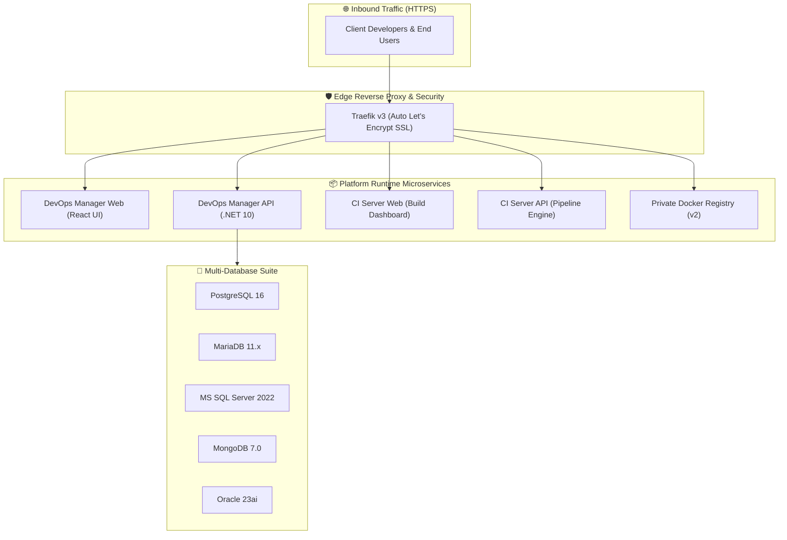

# 🚀 VPS-Infra Enterprise Platform

[](https://www.docker.com/)
[](https://traefik.io/)
[](https://www.postgresql.org/)
[]()
[](https://tmkcomputers.in)

**VPS-Infra** is an enterprise-grade, turn-key DevOps management and CI/CD distribution runtime. It provides automated multi-tenant microservice deployment, Traefik edge routing with automated SSL certificates, a multi-database engine suite, and automated continuous delivery.

---

## 🏛️ Architecture Overview



---

## 💻 Hardware & System Requirements

| Specification | Minimum | Recommended |
|---|---|---|
| **Operating System** | Ubuntu 22.04 / 24.04 LTS | Ubuntu 24.04 LTS (x86_64) |
| **CPU** | 2 vCPUs | 4+ vCPUs |
| **RAM** | 4 GB | 8 GB – 16 GB |
| **Disk Storage** | 40 GB NVMe / SSD | 100 GB+ SSD |
| **Docker Engine** | Docker v24.0+ | Docker v26.0+ & Compose v2 |
| **Open Firewall Ports** | `80/tcp`, `443/tcp` | `80/tcp`, `443/tcp` |

---

## 🚀 Quickstart Installation (3 Steps)

### Step 1: Clone the Runtime Repository
Clone this repository to your target VPS host:
```bash
git clone https://github.com/tmk-computers/vps-infra-client.git /var/www/vps-infra
cd /var/www/vps-infra
```

### Step 2: Configure Environment Variables
Copy `.env.example` to `.env` and fill in your company details and license key:
```bash
cp .env.example .env
nano .env
```

Key fields to configure:
```ini
# Enterprise License provided by TMK Computers
TMK_LICENSE_KEY="eyJjbGllbnRJZCI6..."

# Primary Domain & SSL Contact
PRIMARY_DOMAIN=yourdomain.com
ACME_SSL_EMAIL=admin@yourdomain.com

# Initial SuperAdmin Credentials
SUPERADMIN_EMAIL=admin@yourdomain.com
SUPERADMIN_PASSWORD=YourStrongPassword123!
```

### Step 3: Run the Bootstrap Script
Execute the deployment bootstrap script:
```bash
chmod +x setup.sh
./setup.sh
```

The script will automatically:
1. Verify Docker Engine & Compose dependencies.
2. Initialize directory scaffolding and storage volumes.
3. Generate secure secrets and network bridges (`traefik_net`).
4. Pull production images and launch the platform with automatic SSL.

---

## 🌐 DNS Configuration

Point the following **A Records** to your VPS Public IP address:

| Subdomain | Description | Example URL |
|---|---|---|
| `@` / `yourdomain.com` | Primary Landing / Gateway | `https://yourdomain.com` |
| `devops-manager` | DevOps Management Web UI | `https://devops-manager.yourdomain.com` |
| `devops-api` | DevOps Backend API | `https://devops-api.yourdomain.com` |
| `ci` | CI/CD Dashboard | `https://ci.yourdomain.com` |
| `ci-api` | CI/CD Build Engine API | `https://ci-api.yourdomain.com` |
| `registry` | Docker Container Registry | `https://registry.yourdomain.com` |
| `pgadmin` | PostgreSQL Web Admin *(Optional)* | `https://pgadmin.yourdomain.com` |
| `traefik` | Traefik Routing Dashboard | `https://traefik.yourdomain.com` |

---

## 🔑 Enterprise Licensing & Hardware Fingerprinting

This installation is protected by cryptographic RSA/HMAC hardware licensing.

### Obtaining Server Hardware Fingerprint
To obtain your server's hardware fingerprint for license generation or renewal:
```bash
# Option A: From inside the server
docker exec devops-api-prod curl -s http://localhost:8080/api/License/fingerprint

# Option B: From the Web UI
# Visit https://devops-manager.yourdomain.com -> Click on License badge in Navbar
```

### Activating / Updating License Key
You can update your subscription key at any time:
1. **Via UI**: Paste the new key in the **Subscription Lock Modal** or **License Management Settings** in the web dashboard.
2. **Via `.env`**: Update `TMK_LICENSE_KEY="<new-key>"` in `/var/www/vps-infra/.env` and run:
   ```bash
   docker compose restart devops-api-prod
   ```

---

## 🛠️ Day-2 Operations & Maintenance

### Starting & Stopping Services
```bash
# Start all services in background
docker compose up -d

# Check real-time service status
docker compose ps

# View live aggregate logs
docker compose logs -f

# View logs for a specific service
docker compose logs -f devops-api-prod
```

### Managing Database Engines
```bash
# Check status of all database engines
./db/manage-databases.sh status

# Start or stop specific engines
./db/manage-databases.sh start postgres
./db/manage-databases.sh start mariadb
./db/manage-databases.sh start mongodb
```

### Upgrading Container Images
```bash
# Pull latest container images
docker compose pull

# Apply updates with zero downtime
docker compose up -d --remove-orphans
```

---

## 📞 Support & Inquiries

For license renewals, enterprise support contracts, or custom infrastructure configurations:
* **Website**: [https://tmkcomputers.in](https://tmkcomputers.in)
* **Email Support**: `support@tmkcomputers.in` / `sales@tmkcomputers.in`
* **Documentation**: [https://docs.tmkcomputers.in](https://docs.tmkcomputers.in)

---

*© 2026 TMK Computers. All Rights Reserved.*
