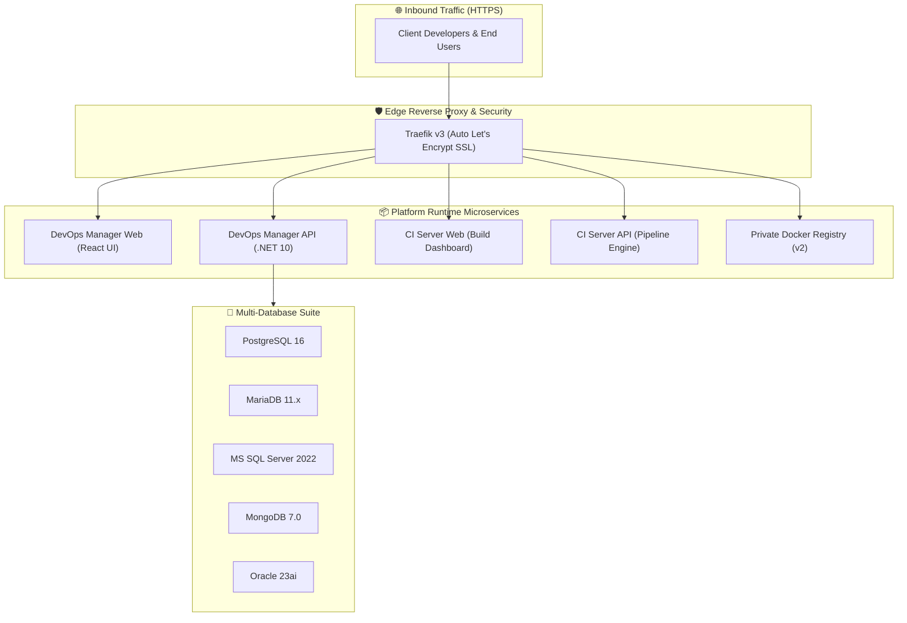
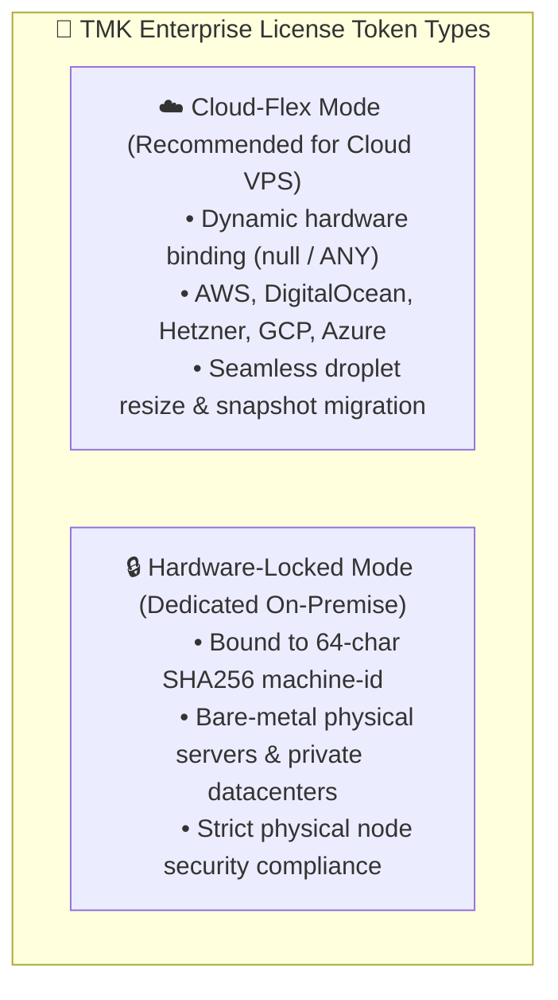

# 🚀 VPS-Infra Enterprise Platform

[](https://www.docker.com/)
[](https://traefik.io/)
[](https://www.postgresql.org/)
[]()
[](https://tmkcomputers.in)

**VPS-Infra** is an enterprise-grade, turn-key DevOps management and CI/CD distribution runtime. It provides automated multi-tenant microservice deployment, Traefik edge routing with automated SSL certificates, a multi-database engine suite, and automated continuous delivery.

---

## 🏛️ Architecture Overview



---

## 💻 Hardware & System Requirements

| Specification | Minimum | Recommended |
|---|---|---|
| **Operating System** | Ubuntu 22.04 / 24.04 LTS | Ubuntu 24.04 LTS (x86_64) |
| **CPU** | 2 vCPUs | 4+ vCPUs |
| **RAM** | 4 GB | 8 GB – 16 GB |
| **Disk Storage** | 40 GB NVMe / SSD | 100 GB+ SSD |
| **Docker Engine** | Docker v24.0+ | Docker v26.0+ & Compose v2 |
| **Open Firewall Ports** | `80/tcp`, `443/tcp` | `80/tcp`, `443/tcp` |

---

## 🚀 Quickstart Installation (6 Steps)

### Step 1: Clone the Runtime Repository
Clone this repository to your target VPS host:
```bash
git clone https://github.com/tmk-computers/vps-infra-client.git /var/www/vps-infra
cd /var/www/vps-infra
```

### Step 2: Configure Environment Variables
Copy `.env.example` to `.env` and fill in your company branding and admin credentials:
```bash
cp .env.example .env
nano .env
```

Key fields to configure:
```ini
# Primary Domain & SSL Contact
PRIMARY_DOMAIN=yourdomain.com
ACME_SSL_EMAIL=admin@yourdomain.com
COMPANY_NAME="Your Company Name"

# Initial SuperAdmin Credentials
SUPERADMIN_EMAIL=admin@yourdomain.com
SUPERADMIN_PASSWORD=YourStrongPassword123!
```

### Step 3: Configure DNS A Records
Point the following **A Records** with your DNS provider (Cloudflare, Route53, GoDaddy) to your VPS Public IP address:

| Subdomain | Description | Example URL |
|---|---|---|
| `@` / `yourdomain.com` | Primary Landing / Gateway | `https://yourdomain.com` |
| `devops-manager` | DevOps Management Web UI | `https://devops-manager.yourdomain.com` |
| `devops-api` | DevOps Backend API | `https://devops-api.yourdomain.com` |
| `ci` | CI/CD Dashboard | `https://ci.yourdomain.com` |
| `ci-api` | CI/CD Build Engine API | `https://ci-api.yourdomain.com` |
| `registry` | Docker Container Registry | `https://registry.yourdomain.com` |
| `pgadmin` | PostgreSQL Web Admin *(Optional)* | `https://pgadmin.yourdomain.com` |
| `traefik` | Traefik Routing Dashboard | `https://traefik.yourdomain.com` |

---

### Step 4: Choose Licensing Mode & Obtain Fingerprint (if applicable)

The platform supports two deployment licensing modes. Choose the one that matches your infrastructure:

#### ☁️ Mode A: Cloud-Flex Mode (Recommended for Cloud VPS: AWS, DigitalOcean, Hetzner, GCP)
* **Fingerprint Required**: **None** (Zero host command execution needed).
* **How it works**: Cloud-Flex uses dynamic cryptographic binding (`hardwareFingerprint: null`). It is designed for cloud virtual machines that frequently migrate host hypervisors, resize vCPUs/RAM, or restore from snapshots without breaking license validity.
* **What you need**: Simply your **Company / Organization Name** (e.g. `"Zila Valley"`).

#### 🔒 Mode B: Hardware-Locked Mode (For Dedicated / Bare-Metal On-Premise)
* **Fingerprint Required**: **Yes** (Bound to unique 64-character SHA-256 machine hash).
* **Command to extract server fingerprint on your host**:
  ```bash
  # Method 1 (Direct Linux Host Shell - Recommended):
  echo -n "TMK-HW-$(cat /etc/machine-id)" | sha256sum | awk '{print $1}'
  ```
  **Example Output**:
  ```text
  b9e4ee73b6b7a63023c8c2c6eb47f71f265d930533b336b6daa5e6f46299c39f
  ```

  ```bash
  # Method 2 (Via Container if containers are already running):
  docker exec ci-api-prod node -e "fetch('http://devops-api-prod:8080/api/License/fingerprint').then(r=>r.json()).then(d=>console.log(d.serverFingerprint))"
  ```

  ```bash
  # Method 3 (From Web UI):
  # Visit https://devops-manager.yourdomain.com -> Click "Copy Server Fingerprint" on the lock screen.
  ```

---

### Step 5: Send Request to TMK Computers for License Key

Send your license request to the **TMK Computers Licensing Team** (`licensing@tmkcomputers.in` or via your dedicated account manager).

#### 📧 Example Request Templates:

##### Option A: Cloud-Flex Request (Cloud VPS)
```text
To: licensing@tmkcomputers.in
Subject: License Request: Cloud-Flex - [Your Company Name]

- Client / Company Name: Zila Valley
- Mode: Cloud-Flex (AWS / DigitalOcean / Hetzner VPS)
- Plan Tier: Enterprise
- Duration: 1 Year (365 Days)
```

##### Option B: Hardware-Locked Request (Dedicated Server)
```text
To: licensing@tmkcomputers.in
Subject: License Request: Hardware-Locked - [Your Company Name]

- Client / Company Name: Zila Valley
- Mode: Hardware-Locked
- Hardware Fingerprint: b9e4ee73b6b7a63023c8c2c6eb47f71f265d930533b336b6daa5e6f46299c39f
- Plan Tier: Enterprise
- Duration: 1 Year (365 Days)
```

TMK Computers will issue your cryptographically signed `TMK_LICENSE_KEY` token string.

---

### Step 6: Run Bootstrap & Activate License (1-Click)
Apply your signed license token using any of these frictionless methods:

#### Option A: 1-Click CLI Script (Recommended)
```bash
cd /var/www/vps-infra

# Automatically configures volume storage, .env, container refresh, and status check:
./activate-license.sh "YOUR_SIGNED_TMK_LICENSE_KEY"
```

#### Option B: Fresh Bootstrap Script with License Flag
```bash
cd /var/www/vps-infra
chmod +x setup.sh
./setup.sh --license "YOUR_SIGNED_TMK_LICENSE_KEY"
```

#### Option C: Live Web UI Activation
1. Navigate to `https://devops-manager.yourdomain.com` in your browser.
2. Paste the token into the **Subscription Lock Screen** modal and click **Activate License**. Activation takes effect **hot in-memory with zero container downtime**.

---

## 🔑 Enterprise Licensing: Cloud-Flex & Hardware-Locked Modes

The VPS-Infra runtime enforces cryptographic HMAC-SHA256 enterprise subscription validation. The platform natively supports two licensing deployment modes depending on your infrastructure topology:



### ☁️ 1. Cloud-Flex Mode (Recommended for Cloud VPS)
* **What it is**: A flexible cryptographic license that is **not** locked to a single physical hardware ID.
* **Why use it**: Cloud virtual machines (AWS EC2, DigitalOcean Droplets, Hetzner Cloud, GCP) frequently change underlying hypervisors when you upgrade RAM/CPU, reboot across host nodes, or restore from snapshots.
* **Benefits**:
  - ✅ **Zero-Downtime Resizing**: Upgrade your VPS vCPUs and RAM without invalidating your license.
  - ✅ **Snapshot & DR Mobility**: Restore backup snapshots to a new region or host seamlessly.
  - ✅ **No Pre-Registration Required**: You do not need to extract a machine fingerprint beforehand; simply request a **Cloud-Flex** token for your company name.

### 🔒 2. Hardware-Locked Mode (For Dedicated / On-Premise)
* **What it is**: A license locked to your server's unique 64-character SHA-256 hardware fingerprint (`SHA256("TMK-HW-" + /etc/machine-id)`).
* **Why use it**: Ideal for high-security on-premise installations, enterprise private clouds, or bare-metal servers requiring strict compliance.
* **Obtaining Server Hardware Fingerprint**: See [Step 4](#step-4-obtain-server-hardware-fingerprint) above.
* **Activating Your License**: See [Step 6](#step-6-run-bootstrap--activate-license-1-click) above.

---

## 🛠️ Day-2 Operations & Maintenance

### Starting & Stopping Services
```bash
# Start all services in background
docker compose up -d

# Check real-time service status
docker compose ps

# View live aggregate logs
docker compose logs -f

# View logs for a specific service
docker compose logs -f devops-api-prod
```

### Managing Database Engines
```bash
# Check status of all database engines
./db/manage-databases.sh status

# Start or stop specific engines
./db/manage-databases.sh start postgres
./db/manage-databases.sh start mariadb
./db/manage-databases.sh start mongodb
```

### Upgrading Container Images
```bash
# Pull latest container images
docker compose pull

# Apply updates with zero downtime
docker compose up -d --remove-orphans
```

---

## 📞 Support & Inquiries

For license renewals, enterprise support contracts, or custom infrastructure configurations:
* **Website**: [https://tmkcomputers.in](https://tmkcomputers.in)
* **Email Support**: `support@tmkcomputers.in` / `sales@tmkcomputers.in`
* **Documentation**: [https://docs.tmkcomputers.in](https://docs.tmkcomputers.in)

---

*© 2026 TMK Computers. All Rights Reserved.*
