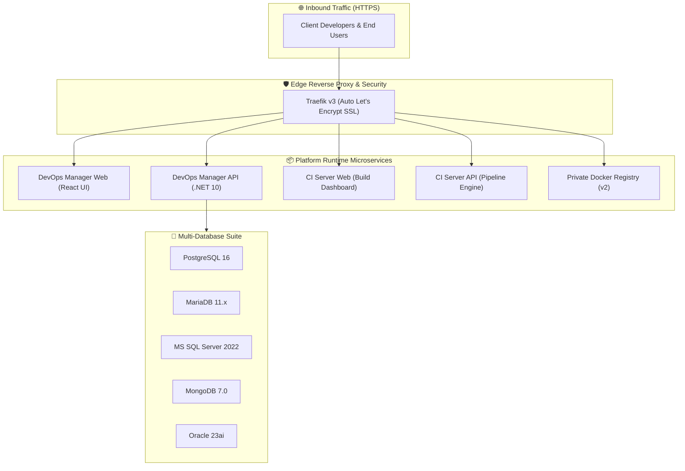
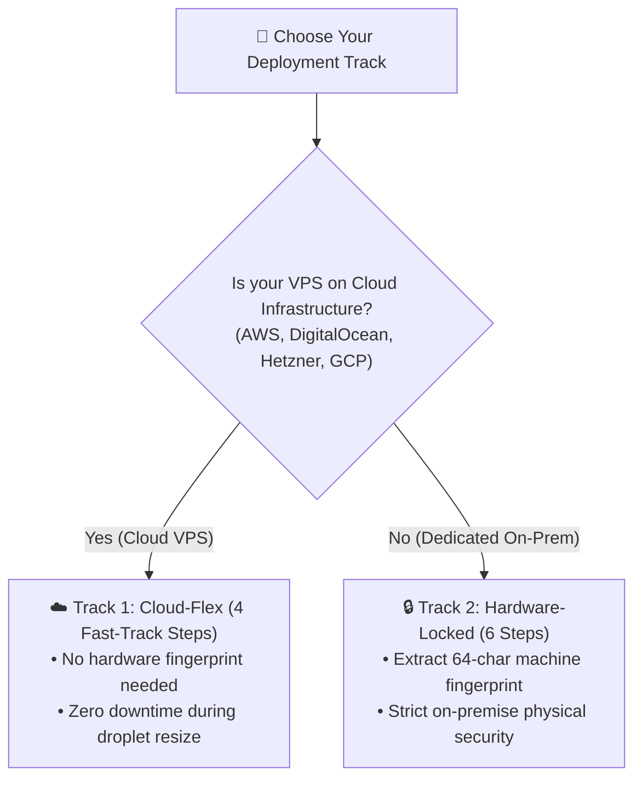
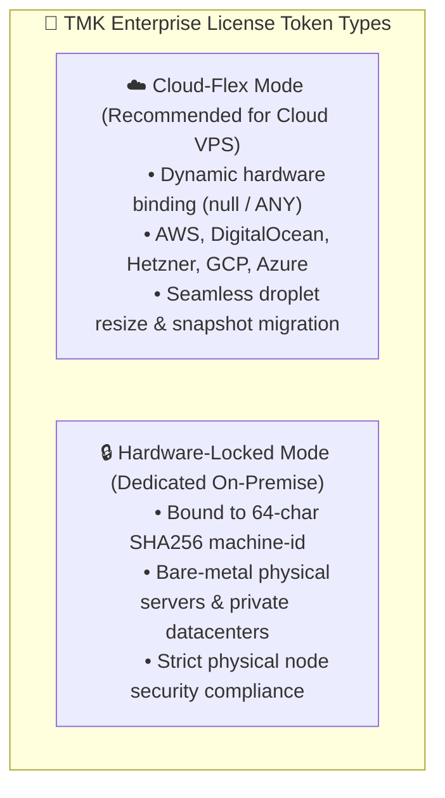

# 🚀 VPS-Infra Enterprise Platform

[](https://www.docker.com/)
[](https://traefik.io/)
[](https://www.postgresql.org/)
[]()
[](https://tmkcomputers.in)

**VPS-Infra** is an enterprise-grade, turn-key DevOps management and CI/CD distribution runtime. It provides automated multi-tenant microservice deployment, Traefik edge routing with automated SSL certificates, a multi-database engine suite, and automated continuous delivery.

---

## 📚 Complete Documentation Hub

| Step | Topic | Detailed Guide |
|:---:|---|---|
| **1** | **Quickstart Installation** | [🐧 Linux VPS Installation Guide](docs/01-getting-started/01-linux-vps-installation.md) |
| **2** | **Subscription Activation** | [🔑 License Activation Guide (Cloud-Flex & Hardware-Locked)](docs/01-getting-started/03-license-activation.md) |
| **3** | **Deploying Applications** | [📦 Web APIs](docs/02-deploying-applications/01-web-apis.md) • [🌐 Frontend SPAs](docs/02-deploying-applications/02-frontend-spas.md) • [📱 Mobile CI/CD](docs/02-deploying-applications/03-mobile-ci-cd.md) |
| **4** | **Database & Backups** | [🔌 Database Connection Strings](docs/03-database-management/01-database-connections.md) • [💾 Automated Daily Backups](docs/03-database-management/02-automated-backups.md) |
| **5** | **Operations & Recovery** | [📜 Logs & Monitoring](docs/04-operations-and-troubleshooting/01-logs-and-monitoring.md) • [🛡️ SSL & Domain Troubleshooting](docs/04-operations-and-troubleshooting/02-ssl-domain-troubleshooting.md) • [🚨 15-Minute Disaster Recovery](docs/04-operations-and-troubleshooting/03-disaster-recovery.md) |

👉 **Full Documentation Hub Index**: [`docs/README.md`](docs/README.md)


## 🏛️ Architecture Overview



---

## 💻 Hardware & System Requirements

| Specification | Minimum | Recommended |
|---|---|---|
| **Operating System** | Ubuntu 22.04 / 24.04 LTS | Ubuntu 24.04 LTS (x86_64) |
| **CPU** | 2 vCPUs | 4+ vCPUs |
| **RAM** | 4 GB | 8 GB – 16 GB |
| **Disk Storage** | 40 GB NVMe / SSD | 100 GB+ SSD |
| **Docker Engine** | Docker v24.0+ | Docker v26.0+ & Compose v2 |
| **Open Firewall Ports** | `80/tcp`, `443/tcp` | `80/tcp`, `443/tcp` |

---

## 🚀 Quickstart Installation

Choose your installation path based on your deployment infrastructure:



---

### ☁️ Track 1: Cloud-Flex Mode (4 Steps — Recommended for Cloud VPS)
*Ideal for AWS EC2, DigitalOcean Droplets, Hetzner Cloud, GCP, Azure, or any virtual cloud host.*

#### Step 1: Request Your Cloud-Flex License Key
Before or during installation, send a license request to the **TMK Computers Licensing Team** (`licensing@tmkcomputers.in` or your dedicated account manager):

```text
To: licensing@tmkcomputers.in
Subject: License Request: Cloud-Flex - [Your Company Name]

- Client / Company Name: Your Company Name
- Mode: Cloud-Flex (AWS / DigitalOcean / Hetzner VPS)
- Plan Tier: Enterprise
- Duration: 1 Year (365 Days)
```
*(💡 **Note**: In Cloud-Flex mode, you do **NOT** need to extract or provide any hardware fingerprint!)*

#### Step 2: Clone the Runtime Repository
Clone this repository to your target cloud VPS:
```bash
git clone https://github.com/tmk-computers/vps-infra-client.git /var/www/vps-infra
cd /var/www/vps-infra
```

#### Step 3: Configure Environment Variables & DNS
```bash
cp .env.example .env
nano .env
```
Key fields to configure:
```ini
# Primary Domain & SSL Contact
PRIMARY_DOMAIN=yourdomain.com
ACME_SSL_EMAIL=admin@yourdomain.com
COMPANY_NAME="Your Company Name"

# Initial SuperAdmin Credentials
SUPERADMIN_EMAIL=admin@yourdomain.com
SUPERADMIN_PASSWORD=YourStrongPassword123!
```

Point the following **A Records** with your DNS provider (Cloudflare, Route53, GoDaddy) to your VPS Public IP address:

| Subdomain | Description | Example URL |
|---|---|---|
| `@` / `yourdomain.com` | Primary Landing / Gateway | `https://yourdomain.com` |
| `devops-manager` | DevOps Management Web UI | `https://devops-manager.yourdomain.com` |
| `devops-api` | DevOps Backend API | `https://devops-api.yourdomain.com` |
| `ci` | CI/CD Dashboard | `https://ci.yourdomain.com` |
| `ci-api` | CI/CD Build Engine API | `https://ci-api.yourdomain.com` |
| `registry` | Docker Container Registry | `https://registry.yourdomain.com` |
| `pgadmin` | PostgreSQL Web Admin *(Optional)* | `https://pgadmin.yourdomain.com` |
| `traefik` | Traefik Routing Dashboard | `https://traefik.yourdomain.com` |

#### Step 4: Run Bootstrap & Activate License (1-Click)
Once you receive your signed `TMK_LICENSE_KEY` token from TMK Computers, launch the entire platform and activate your license in one command:

```bash
cd /var/www/vps-infra
chmod +x setup.sh
./setup.sh --license "YOUR_SIGNED_TMK_LICENSE_KEY"
```

> **Tip for QA / Staging Servers**: To deploy pre-release test builds on a remote test VPS, append `--tag uat`:
> ```bash
> ./setup.sh --tag uat --license "YOUR_SIGNED_TMK_LICENSE_KEY"
> ```

*(If your containers are already running, you can alternatively activate anytime with `./activate-license.sh "YOUR_SIGNED_TMK_LICENSE_KEY"` or via the Web UI lock screen).*

---

### 🔒 Track 2: Hardware-Locked Mode (6 Steps — Dedicated On-Premise)
*Ideal for dedicated bare-metal physical servers requiring strict node hardware compliance.*

#### Step 1: Clone the Runtime Repository
```bash
git clone https://github.com/tmk-computers/vps-infra-client.git /var/www/vps-infra
cd /var/www/vps-infra
```

#### Step 2: Configure Environment Variables & DNS
```bash
cp .env.example .env
nano .env
```
Configure your `PRIMARY_DOMAIN`, `COMPANY_NAME`, and `SUPERADMIN_EMAIL` as shown in Track 1 above, and point your DNS A records to your server's static IP.

#### Step 3: Extract Server Hardware Fingerprint
Run this command on your physical server host:
```bash
# Direct Linux host shell extraction:
echo -n "TMK-HW-$(cat /etc/machine-id)" | sha256sum | awk '{print $1}'
```
**Example Output**:
```text
b9e4ee73b6b7a63023c8c2c6eb47f71f265d930533b336b6daa5e6f46299c39f
```

#### Step 4: Send Fingerprint to TMK Licensing Team
Send your fingerprint to `licensing@tmkcomputers.in`:

```text
To: licensing@tmkcomputers.in
Subject: License Request: Hardware-Locked - [Your Company Name]

- Client / Company Name: Your Company Name
- Mode: Hardware-Locked
- Hardware Fingerprint: b9e4ee73b6b7a63023c8c2c6eb47f71f265d930533b336b6daa5e6f46299c39f
- Plan Tier: Enterprise
- Duration: 1 Year (365 Days)
```

#### Step 5: Receive Cryptographically Locked Token
TMK Computers will issue a `TMK_LICENSE_KEY` token locked to your 64-character machine fingerprint.

#### Step 6: Activate License (1-Click)
```bash
cd /var/www/vps-infra

# Option A: 1-Click CLI Activator (Recommended)
./activate-license.sh "YOUR_SIGNED_TMK_LICENSE_KEY"

# Option B: Web UI Live Activation
# Visit https://devops-manager.yourdomain.com -> Paste token in the lock screen modal -> Click Activate.
```

---

## 🔑 Deep-Dive: Cloud-Flex vs Hardware-Locked Architecture

The VPS-Infra runtime enforces cryptographic HMAC-SHA256 enterprise subscription validation. The platform natively supports two licensing deployment modes depending on your infrastructure topology:



### ☁️ 1. Cloud-Flex Mode (Recommended for Cloud VPS)
* **What it is**: A flexible cryptographic license that is **not** locked to a single physical hardware ID.
* **Why use it**: Cloud virtual machines (AWS EC2, DigitalOcean Droplets, Hetzner Cloud, GCP) frequently change underlying hypervisors when you upgrade RAM/CPU, reboot across host nodes, or restore from snapshots.
* **Benefits**:
  - ✅ **Zero-Downtime Resizing**: Upgrade your VPS vCPUs and RAM without invalidating your license.
  - ✅ **Snapshot & DR Mobility**: Restore backup snapshots to a new region or host seamlessly.
  - ✅ **No Pre-Registration Required**: You do not need to extract a machine fingerprint beforehand; simply request a **Cloud-Flex** token for your company name.

### 🔒 2. Hardware-Locked Mode (For Dedicated / On-Premise)
* **What it is**: A license locked to your server's unique 64-character SHA-256 hardware fingerprint (`SHA256("TMK-HW-" + /etc/machine-id)`).
* **Why use it**: Ideal for high-security on-premise installations, enterprise private clouds, or bare-metal servers requiring strict compliance.
* **Obtaining Server Hardware Fingerprint**: See [Step 4](#step-4-obtain-server-hardware-fingerprint) above.
* **Activating Your License**: See [Step 6](#step-6-run-bootstrap--activate-license-1-click) above.

---

## 🤖 AI-Native Intelligence & Enterprise Privacy

VPS-Infra includes an integrated suite of autonomous DevOps intelligence agents and interactive copilot capabilities designed to streamline operations without compromising data sovereignty:

### 🧠 Core Platform Agents
1. **💬 Interactive DevOps Copilot**: Real-time natural language assistant within the Web UI to query container health, inspect application logs, and diagnose errors token-by-token.
2. **🛡️ DevOps Intelligence Agent**: Automated daily background analysis of system logs, disk growth trends, database backup integrity, and container stability.
3. **🔍 CI/CD Build Failure Diagnostics**: Instant root-cause explanations and suggested fixes when automated test pipelines or container builds fail.
4. **🧹 Resource & Disk Optimizer**: Intelligent detection of dangling Docker images and orphaned volumes with 1-click cleanup proposals.

### 🔒 Strict Data Privacy & Model Modes
* **☁️ Cloud-Enabled Mode**: Connect your team's API keys (OpenAI, Anthropic Claude, Google Gemini) with tenant-level monthly spend caps.
* **🔒 `LOCAL_ONLY` Mode (100% On-Premise)**: Powered by local Ollama CPU inference. Zero source code, database dumps, or server telemetry ever leave your VPS host.

---

## 🛠️ Day-2 Operations & Maintenance

### Starting & Stopping Services
```bash
# Start all services in background
docker compose up -d

# Check real-time service status
docker compose ps

# View live aggregate logs
docker compose logs -f

# View logs for a specific service
docker compose logs -f devops-api-prod
```

### Managing Database Engines
```bash
# Check status of all database engines
./db/manage-databases.sh status

# Start or stop specific engines
./db/manage-databases.sh start postgres
./db/manage-databases.sh start mariadb
./db/manage-databases.sh start mongodb
```

### Upgrading Container Images
```bash
# Pull latest container images
docker compose pull

# Apply updates with zero downtime
docker compose up -d --remove-orphans
```

---

## 📞 Support & Inquiries

For license renewals, enterprise support contracts, or custom infrastructure configurations:
* **Website**: [https://tmkcomputers.in](https://tmkcomputers.in)
* **Email Support**: `support@tmkcomputers.in` / `sales@tmkcomputers.in`
* **Documentation**: [https://docs.tmkcomputers.in](https://docs.tmkcomputers.in)

---

*© 2026 TMK Computers. All Rights Reserved.*
