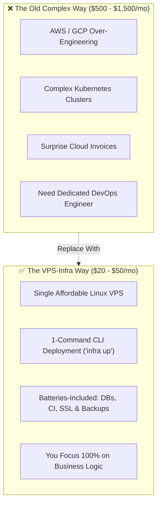

# 🚀 VPS-Infra: The Complete All-in-One Cloud & DevOps Platform for Startups


> **Stop paying $500+/month for complex AWS/GCP setups.**  
> Get an enterprise-grade CI/CD, Multi-Database, and Zero-Downtime Deployment platform on a **single $20–$50/month Linux VPS** in under 5 minutes!

---

```
┌────────────────────────────────────────────────────────────────────────────────────────┐
│                              ⚡ THE 5-MINUTE PROMISE                                  │
│   Push your code to Git ──► Automated Tests & Coverage ──► Zero-Downtime Live HTTPS    │
└────────────────────────────────────────────────────────────────────────────────────────┘
```

---

## 🎯 Why Startups Love VPS-Infra



---

## 💎 6 Game-Changing Benefits for Your Startup

### 1. ⏱️ 5-Minute "Local-to-Cloud" Developer Experience
* **No DevOps headaches**: Run `infra up` on your Linux laptop and go live on your VPS in under 5 minutes.
* **Instant Free SSL**: Traefik automatically provisions and renews **Let's Encrypt HTTPS certificates** for your custom domains.

### 2. 🗄️ 4-Engine Multi-Database Suite (Pre-Installed & Managed)
* **Everything you need out-of-the-box**:
  - 🐘 **PostgreSQL 16** (with `pgvector` ready for AI embeddings)
  - 🐬 **MariaDB 11** / MySQL
  - 🏢 **SQL Server 2022**
  - ⚡ **Oracle 23c Free** + **Redis 7** Cache
* **Automated Daily Backups**: Scheduled automated snapshots uploaded safely to **Google Drive or AWS S3** with **1-Click Disaster Recovery (DR) verification drills**.

### 3. 🧪 Built-in CI/CD Engine with Instant Test Reports
* **Zero GitHub Actions bills**: Run unlimited automated builds and tests right on your VPS.
* **Native Test Parsers**: Instant visual dashboards for **.NET TRX, Java JUnit, Node.js Jest/Playwright, and Pytest**.
* **Code Coverage Verification**: Enforce quality gates with automated **LCOV & Cobertura** line and branch coverage tracking.

### 4. 🔄 Zero-Downtime Deployments
* **Never drop a user request**: When you push new code, our deployment engine performs automated healthcheck verification before seamlessly swapping Docker containers.
* **1-Click Instant Rollback**: If a bug slips through, roll back to the previous healthy build with a single click.

### 5. 📱 Mobile APK & Artifact Streaming Hub
* **Direct distribution for Mobile Apps**: Host and stream Android APKs and iOS assets directly to testers and clients.
* **Fast Downloads**: Built-in **HTTP 206 Partial Content video and APK streaming** with secure expiration tokens.

### 6. 📊 Real-Time Server Health & True Server-Side Pagination
* **Live Telemetry**: Real-time CPU, RAM, Disk, and container KPIs keep you in total control.
* **High Performance**: Lightning-fast UI backed by true SQL-level database pagination (`Skip().Take()`) handling hundreds of thousands of build logs and backup archives without lag.

---

## 💰 Cost Comparison: VPS-Infra vs. Traditional Cloud

| What You Need | AWS / Google Cloud (Traditional) | VPS-Infra Platform | Your Monthly Savings |
| :--- | :---: | :---: | :---: |
| **API & Web App Hosting** | $80 / mo (ECS / App Runner) | **Included** | 🟢 Save $80 |
| **Managed PostgreSQL + Vector** | $75 / mo (RDS + Pinecone) | **Included** (`pgvector`) | 🟢 Save $75 |
| **Managed Redis Cache** | $45 / mo (ElastiCache) | **Included** | 🟢 Save $45 |
| **CI/CD Build Runners & Registry** | $50 / mo (GitHub Actions + ECR) | **Included** (Unlimited) | 🟢 Save $50 |
| **SSL Certificates & Load Balancer** | $25 / mo (AWS ALB) | **Included** (Traefik) | 🟢 Save $25 |
| **Offsite Cloud Backups** | $30 / mo | **Included** (Google Drive/S3)| 🟢 Save $30 |
| **Total Monthly Spend** | **$305 – $700+ / mo** | **$20 – $50 / mo (Single VPS)** | **🔥 Save 90%+ Every Month** |

---

## 🛠️ Supported Tech Stacks (Deploy Anything in Seconds)

```
┌───────────────────────────────────────────────────────────────────────────────────────────┐
│  • .NET 8 / 10 & ASP.NET Core     • Python FastAPI & Django       • Node.js / Express     │
│  • Java Spring Boot 3             • PHP Laravel                   • React / Next.js / Vue │
│  • Android / Flutter APKs         • Dockerized Microservices      • PostgreSQL / Redis    │
└───────────────────────────────────────────────────────────────────────────────────────────┘
```

---

## 🚀 The Bottom Line for Founders & CTOs

> **"You focus 100% on writing your product's business logic. VPS-Infra takes care of your databases, CI/CD, SSL, backups, zero-downtime deployments, and infrastructure stability."**

---

### 📞 Ready to Deploy in 5 Minutes?
* **Website / Repo**: `https://github.com/tmk-computers/vps-infra-legacy`
* **Command**: `infra up --vps`
* **License**: Self-Hostable & Dedicated Startup Packages Available!
