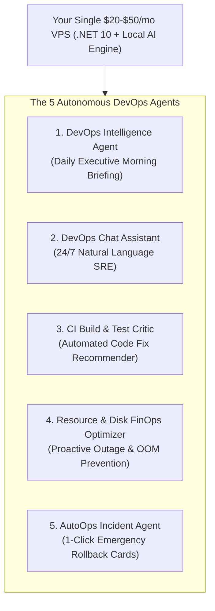

# 🤖 VPS-Infra: The AI-Native Single-VPS DevOps & Autonomous Agent Platform


> **Hire an entire Autonomous AI DevOps & SRE Engineering Team for $0 extra monthly API fees.**  
> Built for ambitious startups running on affordable **$20–$50/month Linux VPS hardware**.

---

```
┌────────────────────────────────────────────────────────────────────────────────────────┐
│                        🧠 THE AUTONOMOUS DEVOPS PROMISE                                │
│   Monitor ──► Diagnose Outages ──► Fix Broken Builds ──► 1-Click Self-Healing Actions │
└────────────────────────────────────────────────────────────────────────────────────────┘
```

---

## 🌟 The Core Breakthrough: Local-First AI SRE on a Single VPS

Most AI platforms force you to pay expensive cloud bills ($0.03/1k tokens) and send your private logs to external cloud APIs. 

**VPS-Infra is completely different**:
* 🔒 **100% Private Local AI**: Powered by an internal quantized local model running directly on your VPS CPU. **Zero data leaves your server**.
* 💸 **$0.00 Monthly LLM API Bills**: Unlimited diagnostics, daily reports, and build analyses for free.
* 🛡️ **Zero-Shell Safety**: No AI agent can ever run dangerous raw bash commands. Destructive actions require **1-Click Cryptographic Human Approvals**.

---

## 👥 Meet Your 5 Autonomous AI DevOps Agents



---

### 1. 🌅 DevOps Intelligence Agent (Daily 8:00 AM Executive Briefing)
* **What it does**: While you sleep, this agent analyzes every deployment, database backup, system metric, and application error from the last 24 hours.
* **The Benefit for Founders**: Wake up to a clean, executive summary in your dashboard or Slack:
  > *"Server Health: 9.4/10. 14 successful builds. Backups verified on S3. Attention: `auth-api` had 3 restarts at 02:15 AM due to DB connection timeout. Recommendation: Increase connection pool."*

### 2. 💬 DevOps Interactive Chat Assistant (24/7 SRE in Your Dashboard)
* **What it does**: Real-time conversational troubleshooting drawer embedded directly in your web management panel.
* **The Benefit for Developers**: Ask any question in plain English and get answers backed by real server data:
  - *"Why is the server slow right now?"* $\rightarrow$ Correlates CPU spikes with recent heavy queries.
  - *"Which container is consuming the most RAM?"* $\rightarrow$ Pinpoints exact memory consumption.
  - *"What changed in the last deployment of billing-api?"* $\rightarrow$ Summarizes git commits and env diffs.

### 3. 🧪 CI Build & Test Failure Critic (Instant Code Fix Diagnosis)
* **What it does**: When an automated test suite (TRX, JUnit, Jest, Playwright, Pytest) fails, this agent immediately parses stack traces, compiler errors, and git diffs.
* **The Benefit for Developers**: Instead of scrolling through 2,000 lines of raw CI logs, developers get an instant diagnostic card:
  > *"Build Failed: `PaymentControllerTests.cs` (Line 42). Expected HTTP 200, got HTTP 401. Root cause: Missing mock for `StripeSignatureHeader`."*

### 4. 🧹 Resource & Disk FinOps Optimizer (Outage & OOM Prevention)
* **What it does**: Proactively inspects dangling Docker image layers, build caches, ballooning database tables, and memory leaks before they cause Out-Of-Memory (OOM) crashes.
* **The Benefit for Startups**: Automatically schedules safe cleanups and warns you before disk space drops below critical thresholds.

### 5. 🚨 AutoOps Incident Remediation Agent (1-Click Safe Self-Healing)
* **What it does**: Detects 5xx error spikes or crash-loops, correlates them with the latest code release, and dispatches a **1-Click WhatsApp / Slack / Web Approval Card**.
* **The Benefit for On-Call Engineers**: One tap on your phone cryptographically signs a safe rollback to the previous healthy container.

---

## 🐍 Build Your Own AI Agents in Python (Polyglot Runtime)

Your team can build customer-facing AI agents using **Python (LangGraph, CrewAI, LlamaIndex, FastAPI)** while running on our high-performance **.NET 10** infrastructure:

```python
from openai import OpenAI

# Connect your Python LangGraph Agent to your VPS Model Gateway!
client = OpenAI(
    base_url="http://devops-api:8080/api/v1/ai", 
    api_key="your_tenant_token"
)

response = client.chat.completions.create(
    model="llama3.2:3b", # Runs 100% locally on your VPS CPU!
    messages=[{"role": "user", "content": "Analyze customer support ticket #1042"}]
)
```

---

## 📊 Platform Comparison: VPS-Infra AI vs. Traditional Cloud

| Capability | AWS + Datadog + OpenAI | VPS-Infra AI-Native Platform |
| :--- | :---: | :---: |
| **Hosting & CI/CD Infrastructure** | $250 / month | **$20 – $50 / month (Single VPS)** |
| **Log Management & APM (Datadog/NewRelic)**| $180 / month | **Included Built-in** |
| **LLM Diagnostic Tokens (Cloud APIs)** | $100 – $300 / month | **$0.00 / month (Local CPU Models)** |
| **AI DevOps & Incident Assistant** | Needs custom engineering | **5 Autonomous Agents Built-in** |
| **Security & Privacy** | Logs sent to 3rd party AI | **100% Private On-Premise / VPS** |
| **Total Startup Cost** | **$530 – $730+ / month** | **$20 – $50 / month (Flat VPS)** |

---

## 🎯 The Bottom Line for Founders & CTOs

> **"You get a world-class DevOps engineer, an SRE incident responder, a CI build assistant, and a private AI gateway—hosted directly on your affordable Linux VPS."**

---

### 🚀 Deploy Your AI-Native Platform Today
* **Command**: `infra up --ai`
* **Requirements**: Any 4 vCPU / 16 GB RAM or 8 vCPU / 32 GB RAM Linux VPS (Ubuntu / Debian).
* **Open & White-Label Ready**: Universal REST/OpenAI-compatible APIs for seamless white-label integration.
