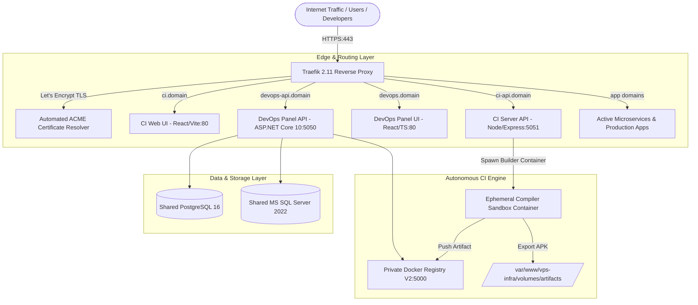
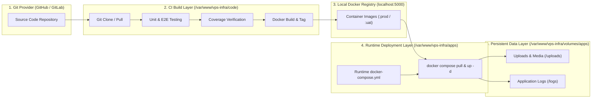

# ⚙️ Managed VPS CI/CD Platform - Technical Architecture & Engineering Guide
### *Deep-Dive System Topology, File System Separation, Compiler Sandboxing, Testing Gates, and Concurrency Benchmarks*

---

## 📑 Technical Table of Contents
1. [System Topology & Component Anatomy](#1-system-topology--component-anatomy)
2. [File System Topology & Storage Architecture (`code`, `apps`, `volumes/apps`)](#2-file-system-topology--storage-architecture)
3. [Compiler Sandboxing & Build Pipelines](#3-compiler-sandboxing--build-pipelines)
4. [Intelligent Caching & Performance Engine](#4-intelligent-caching--performance-engine)
5. [Quality Assurance, E2E Testing & Coverage Gates](#5-quality-assurance-e2e-testing--coverage-gates)
6. [Hardware Sizing & Concurrency Benchmarks (4 vCPU / 16 GB RAM)](#6-hardware-sizing--concurrency-benchmarks)
7. [Security, Authentication & Role-Based Access Control](#7-security-authentication--role-based-access-control)
8. [Database Architecture & Zero-Downtime Migration Protocols](#8-database-architecture--zero-downtime-migration-protocols)
9. [Automated Housekeeping & Resource Reclamation](#9-automated-housekeeping--resource-reclamation)

---

## 1. System Topology & Component Anatomy

The platform operates as a multi-tier orchestration engine containerized via Docker and bound through a high-throughput internal bridge network (`traefik_net`):



### Core Service Specifications

| Service | Technology Stack | Port Mapping | Responsibility |
| :--- | :--- | :--- | :--- |
| **Edge Router** | Traefik 2.11 (Go) | `80`, `443` | Dynamic Let's Encrypt SSL termination, path routing, and load balancing. |
| **DevOps Backend** | ASP.NET Core 10 / EF Core | `5050` (Internal) | Host telemetry, 1-click deployments, user/role RBAC, DB backups. |
| **DevOps Frontend**| React 18, TypeScript, Tailwind | `80` (Internal) | Administration control plane, user directory, container logs viewer. |
| **CI Engine API** | Node.js 20, Express, child_process | `5051` (Internal) | Git webhook consumer, builder sandbox orchestrator, artifact server. |
| **CI Frontend** | React 18, TypeScript, Vite | `80` (Internal) | Real-time build stdout log streamer, build history, APK download hub. |
| **Container Registry**| Docker Registry V2 | `5000` (Internal) | Private container storage, HTTP Basic Auth, layer deduplication. |
| **Shared Databases** | PostgreSQL 16 & MSSQL 2022 | `5432`, `1433` | Dedicated per-service databases (dev, qa, uat, prod) and backups. |

---

## 2. File System Topology & Storage Architecture

A core design principle of the platform is the strict **Separation of Concerns** between raw source code compilation, runtime orchestration, and persistent application state across three designated root directories:



### Detailed Directory Responsibilities & Usage

#### A. `/var/www/vps-infra/code` (Source Code & Build Workspace)
* **Primary Owner**: **CI Server Engine** (`ci-server`)
* **Role**: The compilation, testing, and Docker image build workspace.
* **Usage in CI Server**:
  - Automatically clones or pulls the latest Git branch to `/var/www/vps-infra/code/<repoFolderName>`.
  - Executes unit and integration test runners (`dotnet test`, `npm test`, `mvn test`, `pytest`).
  - Scans and parses code coverage reports (`coverage.cobertura.xml`, `lcov.info`) to enforce minimum threshold gates.
  - Executes `docker build` using the repository Dockerfile, tagging and pushing artifacts to the local registry (`localhost:5000/<service>:<tag>`).
* **Usage in DevOps Manager**:
  - Provides repository metadata inspection (active branch, commit SHA, author, message).
  - Handles manual cloning and branch switching requests triggered by administrators.

#### B. `/var/www/vps-infra/apps` (Live Runtime Orchestration)
* **Primary Owner**: **DevOps Manager** (`devops-manager`)
* **Role**: The production orchestration and running state layer. It contains **no raw source code**—only declarative deployment manifests.
* **Usage in DevOps Manager**:
  - Executes deployment lifecycle commands against `/var/www/vps-infra/apps/<project>/docker-compose.yml`:
    ```bash
    docker compose -f /var/www/vps-infra/apps/<project>/docker-compose.yml pull <serviceName>
    docker compose -f /var/www/vps-infra/apps/<project>/docker-compose.yml up -d --force-recreate <serviceName>
    ```
  - Automatically scaffolds new project runtime directories (`EnsureAppsFolderExists`) with default Traefik network bindings when new projects are registered.
* **Usage in CI Server**:
  - Automatically synchronizes or initializes the runtime compose configuration in `/var/www/vps-infra/apps/<project>` upon initial build completion before invoking the deployment webhook.

#### C. `/var/www/vps-infra/volumes/apps` (Persistent Data & Telemetry)
* **Primary Owner**: **Shared Host / Docker Volumes**
* **Role**: Zero-data-loss persistent storage mounted into running containers.
* **Uploads**: Host volume mount `/var/www/vps-infra/volumes/apps/<service>/uploads` mapped into container `/app/wwwroot/uploads` or `/app/uploads`.
* **Application Logs**: Serilog, Winston, or Logback logs written to `/var/www/vps-infra/volumes/apps/<service>/<env>/logs`, dynamically indexed and downloadable via DevOps Manager App Logs API.
* **Automated Retention & Backups**: Daily background workers archive all active uploads directories and apply retention policies.

---

## 3. Compiler Sandboxing & Build Pipelines

To prevent developer builds from crashing runtime services, all compilations are executed inside **ephemeral sandbox containers** with strict hardware limits:

```
Docker Run Configuration:
  --rm                        (Auto-destroys container after compilation)
  --label buildId=<ID>        (Process tracking and cleanup tag)
  --cpus 2                    (Strictly limits CPU usage to 2 cores)
  -m 4g / 6g                  (Hard memory quota with in-process Kotlin execution)
```

### Supported Technology Stacks & Build Handlers

```
                              [ INCOMING REPO SCANNER ]
                                          │
        ┌───────────────────┬─────────────┴───────┬────────────────────┐
        ▼                   ▼                     ▼                    ▼
  [.NET 10 C# Core]   [Java Spring Boot]    [Python FastAPI]     [Mobile Android]
   - SDK: 10.0         - OpenJDK 17/21       - Python 3.10-slim   - Flutter Stable
   - dotnet build      - Maven (mvn test)    - pytest suites      - React Native
   - Coverlet Tests    - JaCoCo Coverage     - pytest-cov         - Native Android (Kotlin/Java)
```

* **Frontend Web Apps (React / Vite / Angular)**: Multi-stage Docker builds compiled with Node 20-alpine, exported to Nginx alpine runtime containers.
* **Backend APIs (.NET 10 Core / Java / Python)**: Automated unit tests, integration test suite execution, JaCoCo/Coverlet coverage verification, and containerization.
* **Mobile Apps (Flutter, React Native & Native Android)**: Headless compilation of signed Android release APKs (`split-per-abi arm64-v8a`, universal releases, and Native Gradle Kotlin DSL/Groovy outputs). Detailed guide in [`NATIVE_ANDROID_APK_BUILD_PIPELINE.md`](./NATIVE_ANDROID_APK_BUILD_PIPELINE.md).

---

## 4. Intelligent Caching & Performance Engine

By mounting persistent host volumes into compiler sandboxes, subsequent build times are reduced by up to **90%**:

| Cache Layer | Host Path | Container Target | Purpose | Build Speedup |
| :--- | :--- | :--- | :--- | :--- |
| **Gradle Cache** | `ci-server/gradle-cache` | `/root/.gradle` | Reuses Maven artifacts & wrapper binaries | 12m ➔ 2.5m |
| **Pub Cache** | `ci-server/pub-cache` | `/root/.pub-cache` | Reuses resolved Flutter/Dart packages | 4m ➔ 45s |
| **C++ ccache** | `ci-server/ccache` | `/root/.ccache` | Retains native compiled modules (Reanimated/C++) | 15m ➔ 4m |
| **Android SDK** | `ci-server/android-sdk` | `/opt/android-sdk/` | Preserves NDK, CMake, and Build-Tools | Saves 3GB download/build |
| **NuGet Cache** | `ci-server/nuget-cache` | `/root/.nuget` | Retains .NET package assemblies | 3m ➔ 30s |
| **Maven Cache** | `ci-server/maven-cache` | `/root/.m2` | Retains Java dependency jars | 5m ➔ 45s |

---

## 5. Quality Assurance, E2E Testing & Coverage Gates

Every build pipeline enforces strict multi-tier quality gates before pushing to the container registry:

```
[ Git Push ] ──► [ Unit & Integration Tests ] ──► [ Playwright Headless E2E ] ──► [ Coverage Check ] ──► [ Registry Push ]
```

1. **API Integration Tests**: Executes unit test suites against ephemeral testing database schemas.
2. **Headless Playwright E2E Browser Testing**:
   - Spawns headless Chromium instances (`mcr.microsoft.com/playwright:v1.60.0-noble`).
   - Simulates real user browser flows (authentication, CRUD operations, form submissions).
   - Generates test execution logs and stores granular test reports in the database (`ci_build_tests`).
3. **Code Coverage Gates ([coverage-verifier.js](file:///var/www/vps-infra/ci-server/api/coverage-verifier.js))**:
   - Parses JaCoCo XML, Coverlet JSON, or pytest-cov XML reports.
   - Enforces minimum code coverage thresholds before declaring build success.

---

## 6. Hardware Sizing & Concurrency Benchmarks

### Workload Profile on Standard 4 vCPU / 16 GB RAM / 200 GB NVMe VPS

```
Total Memory Allocation Budget (16 GB):
  ├── OS, Kernel Buffers & Traefik SSL Router:   ~0.8 GB
  ├── Shared PostgreSQL 16 & SQL Server 2022:    ~3.0 GB
  ├── React Web Frontend (Nginx):                ~0.1 GB
  ├── Backend API (.NET 10 Core / Spring Boot):  ~0.8 GB – 1.5 GB
  ├── Python FastAPI AI Service:                 ~2.5 GB
  ├── Ephemeral CI Build Sandbox (Throttled):    ~4.0 GB (Active during builds)
  └── Host Page Cache & Memory Headroom:         ~4.0 GB (Buffers)
```

### Concurrency & Throughput Benchmarks

| Application / Workload Scenario | Requests / Second (RPS) | Concurrent Active Online Users |
| :--- | :--- | :--- |
| **Standard Web & API Traffic** *(React + .NET 10 / Spring Boot + DB)* | **800 – 1,500 req/sec** | **5,000 – 10,000 active browsing users** |
| **Mixed Traffic** *(Web + API + ~10% users calling AI endpoints)* | **200 – 500 req/sec** | **1,500 – 3,500 active users** |
| **Heavy AI / CPU-Bound Inferences** *(Continuous image / OMR OCR)* | **15 – 35 AI req/sec** | **300 – 800 active uploaders** |

---

## 7. Security, Authentication & Role-Based Access Control

* **Unified JWT SSO**: HMAC-SHA256 JWT tokens issued by the DevOps Auth API (`/api/Auth/login`) are shared with the CI API (`ci-api`) using a synchronized `JWT_SECRET`.
* **RBAC Authorization**: Enforced across 6 standard roles:
  * `SuperAdmin`, `Admin`, `DevOps`, `Developer`, `Manager`, `Viewer`.
* **Machine-to-Machine Authentication**:
  * Git Webhook endpoints (`/api/ci/webhook/:serviceId`) authenticate via per-service `x-webhook-token` headers or HMAC signature validation.
  * Developers can use personal API Bearer tokens for CLI automation.
* **Network Isolation**: Direct container-to-container communication is restricted to the internal Docker bridge network (`traefik_net`). Public exposure is strictly mediated by Traefik on ports `80` and `443`.

---

## 8. Database Architecture & Zero-Downtime Migration Protocols

### Safe Two-Phase Database Migration Standard
Rolling back a Docker container does not automatically revert database schema migrations. All application migrations must be **additive**:

```
Phase 1 (Release N):   Add new nullable column 'NewField' -> Code writes to both 'OldField' and 'NewField'.
Phase 2 (Migration):   Run background data backfill script from 'OldField' to 'NewField'.
Phase 3 (Release N+1): Remove references to 'OldField' and drop column safely.
```

*Result: Both the current release and previous historical rollback checkpoints can run concurrently without SQL exceptions.*

---

## 9. Automated Housekeeping & Resource Reclamation

To guarantee uninterrupted operations on a 200 GB volume, the platform runs automated maintenance:

* **Daily 2:00 AM IST**: Database snapshot dump (PostgreSQL & MSSQL) saved to `/var/www/vps-infra/volumes/db-backups/` and synchronized to offsite storage (S3/Google Drive).
* **Daily 3:00 AM IST**:
  - `docker container prune -f` & `docker image prune -a -f`
  - `docker builder prune -a -f` (Reclaims BuildKit cache)
  - Docker registry garbage collection (`registry garbage-collect`)
  - Database console log pruning (cleans logs older than `LOG_RETENTION_DAYS`, defaulting to 14 days).
