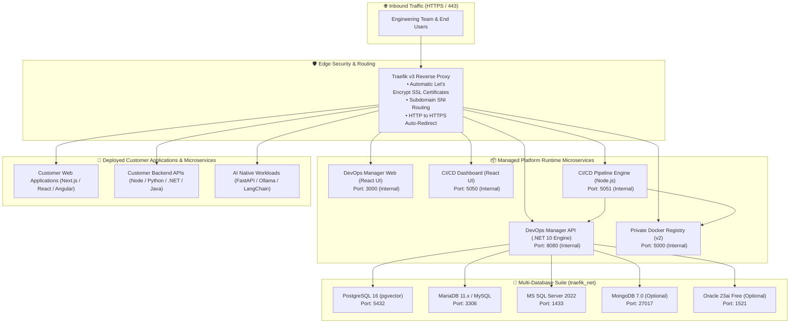

# 🏛️ VPS-Infra Client Runtime Architecture & Topology

---

## 🎯 Executive Overview

**VPS-Infra** is an enterprise turn-key DevOps management, multi-database engine, and automated continuous delivery runtime deployed directly onto your Linux VPS.

All microservices run as optimized, containerized runtime images on an isolated Docker network (`traefik_net`), protected by Traefik v3 reverse proxy with automated Let's Encrypt SSL/TLS termination.

---

## 🌐 Platform Architecture Topology



---

## 🗄️ Storage & Persistent Volume Layout

All application data, databases, secrets, and build artifacts persist in host directories under `/var/www/vps-infra/volumes`:

```
/var/www/vps-infra/
├── .env                       # Primary domain, SSL email, and credentials
├── docker-compose.yml         # Platform service orchestrator
├── setup.sh                   # 1-Click platform initialization script
├── activate-license.sh        # 1-Click enterprise license activator
├── volumes/
│   ├── apps/                  # Isolated directories for deployed customer apps
│   ├── apk/                   # Mobile APK builds and public distribution downloads
│   ├── artifacts/builds/      # Web and API compiled build artifacts
│   ├── db/
│   │   ├── postgres/data/     # PostgreSQL physical data storage
│   │   ├── postgres/backups/  # Automated nightly database dumps (.sql.gz)
│   │   └── pgadmin/           # pgAdmin session configuration
│   └── license.key            # Enterprise license key storage file
└── network/
    └── traefik/
        ├── acme.json          # Let's Encrypt SSL/TLS certificates storage
        └── users.htpasswd     # Traefik dashboard authentication
```

---

## 🛡️ Security & Isolation Model

1. **Zero External Port Exposure**:
   - Only ports `80/tcp` (HTTP) and `443/tcp` (HTTPS) are exposed to the public internet.
   - Databases (PostgreSQL, MariaDB, SQL Server, MongoDB) and internal APIs communicate exclusively across the private Docker network (`traefik_net`).
2. **Automated SSL/TLS**:
   - Every registered subdomain receives a dedicated SSL certificate via Let's Encrypt ACME HTTP-01 challenge.
3. **Data Sovereignty**:
   - **100% of your data remains on your VPS**. No database records or customer uploads are sent to third-party clouds.
