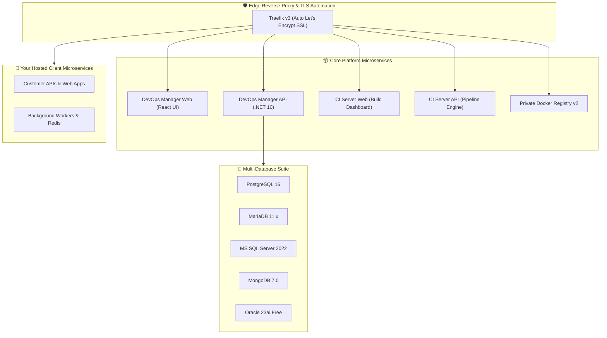

# 🚀 VPS-Infra: Client DevOps Administration & Deployment Guide

Welcome to the **VPS-Infra Platform**. This comprehensive runbook provides everything your DevOps, SysAdmin, and Engineering teams need to deploy, configure, secure, and maintain the VPS-Infra suite.

---

## 🏛️ 1. Infrastructure Architecture

VPS-Infra delivers a production-ready, cloud-native runtime on single or multi-tenant VPS instances:



### 📦 Pre-Built Container Image Distribution:
All core services are distributed as pre-compiled, production-hardened container images via GitHub Container Registry (`ghcr.io`). **No compilers, SDKs, or raw source code are required on the host server**:
* `ghcr.io/tmk-computers/tmk-devops-api:v2.1`
* `ghcr.io/tmk-computers/tmk-devops-web:v2.1`
* `ghcr.io/tmk-computers/tmk-ci-api:v2.1`
* `ghcr.io/tmk-computers/tmk-ci-web:v2.1`

---

## 💻 2. System & Hardware Prerequisites

Ensure your target server meets the following specifications before beginning installation:

| Requirement | Minimum | Recommended Production |
|---|---|---|
| **OS** | Ubuntu 22.04 LTS / 24.04 LTS | Ubuntu 24.04 LTS (x86_64) |
| **CPU** | 2 vCPUs | 4 – 8+ vCPUs |
| **Memory (RAM)** | 4 GB | 8 GB – 16 GB+ |
| **Disk Storage** | 40 GB NVMe / SSD | 100 GB+ High-Speed SSD |
| **Docker Engine** | Docker v24.0+ | Docker v26.0+ & Compose v2 |
| **Network Ports** | `80/tcp`, `443/tcp` open to internet | `80/tcp`, `443/tcp` |

---

## 🚀 3. Step-by-Step Production Installation

### Step 1: Clone the Runtime Repository
Clone this repository to `/var/www/vps-infra`:
```bash
git clone https://github.com/tmk-computers/vps-infra-client.git /var/www/vps-infra
cd /var/www/vps-infra
```

### Step 2: Configure Environment Variables
Copy `.env.example` to `.env`:
```bash
cp .env.example .env
nano .env
```

Configure your core values:
```ini
# 1. ENTERPRISE LICENSE
TMK_LICENSE_KEY="eyJjbGllbnRJZCI6..." # Supplied by TMK Computers

# 2. BRANDING & DOMAIN CONFIGURATION
COMPANY_NAME="Acme Corp"
PRIMARY_DOMAIN=yourdomain.com
ACME_SSL_EMAIL=admin@yourdomain.com

# 3. INITIAL SUPERADMIN CREDENTIALS
SUPERADMIN_EMAIL=admin@yourdomain.com
SUPERADMIN_PASSWORD=YourSecureSuperAdminPassword123!
```

### Step 3: Run the Bootstrap Script
Execute the deployment script:
```bash
chmod +x setup.sh
./setup.sh
```

---

## 🌐 4. DNS Records Configuration

Configure the following **A Records** with your DNS provider (Cloudflare, Route53, GoDaddy, etc.) pointing to your VPS public IP:

| Subdomain | Target | Purpose |
|---|---|---|
| `@` | `YOUR_SERVER_IP` | Primary Landing Page |
| `devops-manager` | `YOUR_SERVER_IP` | DevOps Manager Web Dashboard |
| `devops-api` | `YOUR_SERVER_IP` | DevOps Backend REST API |
| `ci` | `YOUR_SERVER_IP` | CI/CD Build Pipeline Dashboard |
| `ci-api` | `YOUR_SERVER_IP` | CI Build Webhooks & Artifact Streaming |
| `registry` | `YOUR_SERVER_IP` | Private Docker Image Registry |
| `pgadmin` | `YOUR_SERVER_IP` | PostgreSQL Web Management Interface |
| `traefik` | `YOUR_SERVER_IP` | Traefik Router & TLS Status Dashboard |

---

## 🔑 5. Enterprise License Lifecycle & Scenarios

VPS-Infra enforces hardware-locked cryptographic licensing. Below are the standard operational scenarios and step-by-step resolution guides:

---

### 🚨 Scenario 1: Fresh VPS Cloned Without a License Key (Unlicensed Lockout)
**What Happens:**
If a new client clones the repository and starts the framework without providing a valid `TMK_LICENSE_KEY` in `.env`:
1. **API Behavior**: The backend API rejects all project creations, git deployments, and database mutations with **`HTTP 402 Payment Required`**.
2. **Dashboard UI**: The web frontend displays the **Subscription Lockout Screen**:
   > *"Enterprise License Required: No active license key was found for this installation. Please contact TMK Computers to activate your server."*
3. **Hardware Fingerprint**: The screen displays your unique **Server Hardware Fingerprint** (e.g. `b9e4ee73b6b7a630...`).

**How to Activate:**
1. Retrieve your server hardware fingerprint using any of these methods:
   ```bash
   # Method 1 (Recommended):
   docker exec ci-api-prod node -e "fetch('http://devops-api-prod:8080/api/License/fingerprint').then(r=>r.json()).then(d => console.log(d.serverFingerprint))"

   # Method 2 (Direct from Host Shell):
   echo -n "TMK-HW-$(cat /etc/machine-id)" | sha256sum | awk '{print $1}'

   # Method 3 (From Web UI):
   # Visit https://devops-manager.yourdomain.com -> Click "Copy Fingerprint" on the lock screen
   ```
2. Send this fingerprint to **TMK Computers Licensing Team** (`licensing@tmkcomputers.in` or via your client account manager).
3. TMK Computers issues your cryptographic `TMK_LICENSE_KEY`.
4. Apply the key using any method:
   - **Method A (1-Click CLI Script - Recommended)**:
     ```bash
     cd /var/www/vps-infra
     ./activate-license.sh "YOUR_SIGNED_TOKEN_HERE"
     ```
   - **Method B (Web Dashboard)**:
     Paste the token directly into the License Activation modal on your browser screen and click **Activate License**.
   - **Method C (Initial Bootstrap Flag)**:
     ```bash
     ./setup.sh --license "YOUR_SIGNED_TOKEN_HERE"
     ```
5. Refresh your browser — all services, features, and database engines instantly unlock with full enterprise access.

---

### ⏳ Scenario 2: License Has Expired or Been Revoked (Renewal Flow)
**What Happens:**
When your license duration reaches `0 days` (or if your agreement is suspended):
1. **API & Deployment Freeze**: Automated build runners, deployments, and database provisioning are halted with an error message:
   > *"License Expired: Your enterprise subscription expired on YYYY-MM-DD. Please renew your subscription to resume operations."*
2. **Data Preservation**: **100% of your databases, customer uploads, APKs, and volumes remain completely safe and intact** on disk. No data is lost.
3. **Renewal Screen**: The dashboard displays a renewal prompt with an activation input and quick contact link.

**How to Renew:**
1. Contact TMK Computers for subscription renewal.
2. Once you receive your renewed `TMK_LICENSE_KEY`, apply it in one command:
   ```bash
   cd /var/www/vps-infra
   ./activate-license.sh "YOUR_NEW_RENEWED_TOKEN"
   ```
3. The Navbar badge updates immediately (e.g., `Enterprise Ultimate • 365d`) and all platform capabilities resume instantly.

---

## 🔄 6. Release & Hotfix Updates (Client Upgrade Runbook)

When TMK Computers releases new features, performance updates, or security hotfixes:

### Step 1: Pull the Updated Orchestration Scripts
```bash
cd /var/www/vps-infra
git pull origin main
```

### Step 2: Download the New Pre-Built Container Images
```bash
docker compose pull
```
*(Docker pulls the new pre-compiled images from `ghcr.io/tmk-computers/tmk-*` in seconds without requiring compilers or build tools).*

### Step 3: Apply the Update (Zero-Downtime)
```bash
docker compose up -d --remove-orphans
```

### 🛡️ What is Preserved During Updates:
* ✅ All active databases (PostgreSQL, MariaDB, MSSQL, Mongo, Oracle) maintain their data.
* ✅ All customer uploads, APKs, and build artifacts in `/var/www/vps-infra/volumes/` are untouched.
* ✅ All custom `.env` domain settings, SSL certificates, and license tokens remain intact.

---

## 🛠️ 7. Day-2 Operations Runbook

### Service Lifecycle Management:
```bash
# Check running container health
docker compose ps

# View live consolidated logs
docker compose logs -f

# Restart core API services
docker compose restart devops-api-prod devops-web-prod
```

### Database Engine Administration:
VPS-Infra includes a dedicated database management CLI tool in `db/`:
```bash
# Check status of all database engines
./db/manage-databases.sh status

# Start or stop individual database engines on demand:
./db/manage-databases.sh start postgres
./db/manage-databases.sh start mariadb
./db/manage-databases.sh start mongodb
./db/manage-databases.sh start sql-server
./db/manage-databases.sh start oracle
```

---

## 📞 8. Enterprise Support & Contact

For assistance, custom extensions, or licensing renewals:
* **Support Email**: `support@tmkcomputers.in`
* **Enterprise Portal**: [https://tmkcomputers.in](https://tmkcomputers.in)
* **Documentation**: [https://docs.tmkcomputers.in](https://docs.tmkcomputers.in)

---

*© 2026 TMK Computers. All Rights Reserved.*
