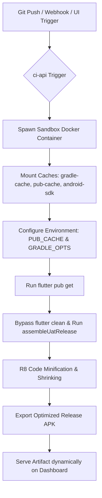

# 📱 Flutter Android APK Build Pipeline Guide

This documentation guides you through the setup, configuration, and optimizations integrated into the DevOps CI/CD pipeline for building Flutter Android APKs on the 16 GB RAM host VPS.

---

## 1. Pipeline Architecture & Flow

The CI server automatically detects Flutter projects and handles compilation securely inside isolated sandboxes to protect host resources and speed up iterations:



---

## 2. CI Server Integration (`vps-infra/ci-server`)

### A. Docker Sandbox Container
Flutter builds are isolated inside the standard `ghcr.io/cirruslabs/flutter:stable` container (packaged with the target Flutter SDK, Dart SDK, and OpenJDK).

### B. Host Resource Protections
To prevent heavy compilation and dexing threads from overloading the 16 GB VPS and freezing other services, builds are throttled in [`build-runner.js`](file:///var/www/vps-infra/ci-server/api/build-runner.js) using:
*   CPU limit: `--cpus 2`
*   Memory limit: `-m 6g`
*   Parallel compilation throttle: `-e CMAKE_BUILD_PARALLEL_LEVEL=1`
*   Gradle workers throttle: `-e GRADLE_OPTS=-Dorg.gradle.jvmargs=-Xmx2048m -Dorg.gradle.workers.max=1`

### C. Caching Strategy (Build Speedups)
To reduce Flutter build times from 12+ minutes down to **under 2.5 minutes**, the following persistent caching layers are mounted:
1.  **Gradle Cache**: Mounts `/var/www/vps-infra/ci-server/gradle-cache` as `/root/.gradle` inside the container to preserve downloaded Maven dependencies and wrapper targets.
2.  **Pub Package Cache**: Mounts `/var/www/vps-infra/ci-server/pub-cache` as `/root/.pub-cache` inside the container, coupled with `-e PUB_CACHE=/root/.pub-cache` to preserve resolved Dart packages.
3.  **Android SDK Cache**: To prevent downloading platform and compilation tools on every build, individual host directories are mapped directly to the SDK path inside the container:
    *   NDK: `/var/www/vps-infra/ci-server/android-sdk/ndk` -> `/opt/android-sdk-linux/ndk`
    *   Platforms: `/var/www/vps-infra/ci-server/android-sdk/platforms` -> `/opt/android-sdk-linux/platforms`
    *   CMake: `/var/www/vps-infra/ci-server/android-sdk/cmake` -> `/opt/android-sdk-linux/cmake`
    *   Build Tools: `/var/www/vps-infra/ci-server/android-sdk/build-tools` -> `/opt/android-sdk-linux/build-tools`
4.  **Bypassing clean**: The `flutter clean` step is omitted by default from the build command, allowing Gradle to reuse the compilation targets inside the persistent `build/` directory.

---

## 3. App Codebase Configuration

Every Flutter application repository contains three main optimization configurations:

### A. Gradle properties (`gradle.properties`)
Located inside `android/gradle.properties` in each repository:
```properties
# Disable Gradle background daemons to keep container lightweight
org.gradle.daemon=false
org.gradle.caching=true

# Force Kotlin compiler to run in-process (saves ~2 GB RAM)
kotlin.compiler.execution.strategy=in-process

# Enable built-in Kotlin support
android.builtInKotlin=true
```

### B. Split-ABI Filename Resolver (`build.gradle.kts`)
Located inside `android/app/build.gradle.kts`. When building using `--split-per-abi`, Gradle generates separate APKs for each architecture. To ensure the CI server artifact exporter finds the target APK, custom filename overrides are modified to preserve the target ABI filter:
```kotlin
android {
    applicationVariants.all {
        outputs.all {
            val output = this as com.android.build.gradle.internal.api.ApkVariantOutputImpl
            val isUat = project.hasProperty("uat")
            val buildTypeName = if (isUat) "uat-release" else "release"
            
            val abiFilter = output.getFilter(com.android.build.OutputFile.ABI)
            if (abiFilter != null) {
                outputFileName = "app-${abiFilter}-${buildTypeName}.apk"
            } else {
                outputFileName = "${projectName}-${buildTypeName}.apk"
            }
        }
    }
}
```

### C. 16 KB ELF Binary Alignments (Android 15+ Compatibility)
To support 16 KB page-aligned systems in Android 15+, packaging legacy options are disabled in `android/app/build.gradle.kts`:
```kotlin
android {
    packaging {
        jniLibs {
            useLegacyPackaging = false
        }
    }
}
```

---

## 4. Verification & Troubleshooting

### A. Triggering a Manual Build Run (Authenticated API)
You can initiate a build programmatically by sending a POST request with your JWT Bearer token:

```bash
curl -X POST https://ci-api.yourdomain.com/api/ci/build \
  -H "Authorization: Bearer <YOUR_JWT_TOKEN>" \
  -H "Content-Type: application/json" \
  -d '{
    "serviceId": "YOUR_PROJECT_SERVICE_ID",
    "branch": "main",
    "triggeredBy": "developer_manual"
  }'
```

### B. Out of Memory (OOM) Recovery
If a build crashes due to memory limits, verify that `org.gradle.daemon=false` and `kotlin.compiler.execution.strategy=in-process` are active in the target codebase, as Gradle daemons running outside the worker can exhaust the 6 GB RAM limits of the sandbox container.
