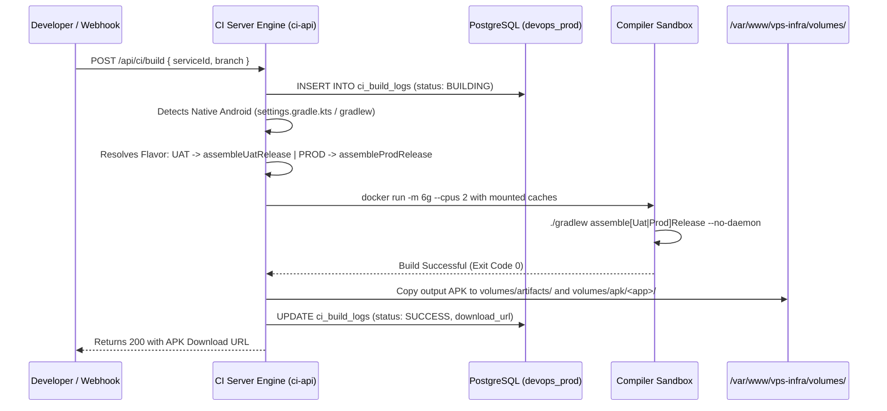

# Complete Migration & Adaptation Guide: Native Android Application to Linux CI/CD Pipeline (VPS-Infra)

## Executive Summary & Architecture Overview

This migration guide details the technical requirements, configuration changes, memory tuning, and codebase adaptations necessary to migrate a **Native Android application** (Java / Kotlin with Gradle) from a manual **local developer workstation (Android Studio on Windows/macOS)** to the automated **Linux Dockerized CI/CD build pipeline** running on the **VPS-Infra** platform.

```
+---------------------------------------------------------------------------------------------------+
|                                      VPS-INFRA CI/CD PLATFORM                                     |
|                                                                                                   |
|  [ Developer Git Push / Webhook / Web UI ]                                                        |
|                       |                                                                           |
|                       v                                                                           |
|  +---------------------------------------------------------------------------------------------+  |
|  |                     CI SERVER ENGINE (ci-api-prod / Node.js 20 ES Module)                   |  |
|  |   - Auto-detects Native Android project structure (settings.gradle.kts / app / gradlew)     |  |
|  |   - Resolves target deployment environment (UAT vs PROD)                                    |  |
|  +---------------------------------------------------------------------------------------------+  |
|                       |                                                                           |
|                       v (Spawns Docker Sandbox Container)                                         |
|  +---------------------------------------------------------------------------------------------+  |
|  |           DOCKER BUILD SANDBOX (reactnativecommunity/react-native-android:latest)            |  |
|  |                                                                                             |  |
|  |   Resource Quotas:   --cpus 2   |   -m 6g RAM Limit                                         |  |
|  |   JVM Tuning:        -Xmx2560m  |   workers.max=1   |   daemon=false                        |  |
|  |                                                                                             |  |
|  |   Mounted Host Caches:                                                                      |  |
|  |     /var/www/vps-infra/ci-server/gradle-cache     ---> /root/.gradle                        |  |
|  |     /var/www/vps-infra/ci-server/android-sdk/build-tools ---> /opt/android/build-tools        |  |
|  |     /var/www/vps-infra/ci-server/android-sdk/platforms   ---> /opt/android/platforms          |  |
|  |                                                                                             |  |
|  |   Target Execution:                                                                         |  |
|  |     UAT:  ./gradlew assembleUatRelease  (Injects UAT API URL)                               |  |
|  |     PROD: ./gradlew assembleProdRelease (Injects Production API URL)                        |  |
|  +---------------------------------------------------------------------------------------------+  |
|                       |                                                                           |
|                       v                                                                           |
|  +---------------------------------------------------------------------------------------------+  |
|  |                         PERSISTENT ARTIFACT & DISTRIBUTION LAYER                           |  |
|  |   - /var/www/vps-infra/volumes/artifacts/builds/<buildId>/<app>-<env>-release.apk           |  |
|  |   - /var/www/vps-infra/volumes/apk/<app>/<env>/<app>-<env>-release.apk                      |  |
|  |   - Download URL: https://ci-api.tmkcomputers.in/artifacts/builds/<buildId>/...apk         |  |
|  +---------------------------------------------------------------------------------------------+  |
+---------------------------------------------------------------------------------------------------+
```

---

## 1. Key Differences: Local Android Studio vs Linux Container CI

| Aspect / Constraint | Local Workstation (Android Studio) | Linux Docker CI Pipeline (`vps-infra`) |
| :--- | :--- | :--- |
| **Execution Environment** | GUI IDE on Windows/macOS with GUI prompts | Headless Linux container (`OpenJDK 17` + Android SDK CLI) |
| **Memory Allocation** | 16–32 GB RAM dedicated to Gradle daemons | Shared 16 GB host VPS with hard **6 GB container limit** |
| **Gradle Daemon Model** | Long-lived daemon processes (`org.gradle.daemon=true`) | Single-use ephemeral executions (`org.gradle.daemon=false`) to avoid orphan leaks |
| **Filesystem & Resource Assets** | Case-insensitive on Windows/macOS NTFS | Strict case-sensitivity under Linux AAPT2 (`[a-z0-9_]` only) |
| **Release Signing** | Manual interactive password prompt / local keystore | Automated headless signing (`debug` keystore or CI injected keystore) |
| **Environment Switching** | Manually editing `Config.java` / code comments | Gradle `productFlavors` + `buildConfigField` (`assembleUatRelease` vs `assembleProdRelease`) |
| **Google Services Config** | Local file ignored in `.gitignore` | Automated CI fallback generator for missing `google-services.json` |
| **Artifact Distribution** | Manual APK file copy from `app/build/outputs/apk/` | Automated persistent volume placement and HTTPS download endpoints |

---

## 2. Step-by-Step Codebase Adaptation Checklist

To make any native Android repository build smoothly in the CI/CD pipeline, apply the following 7 standard adaptations:

---

### Step 1: Fix Resource Naming for Linux AAPT2 Case Sensitivity

Windows and macOS file systems ignore uppercase characters in resource paths. On Linux, the Android Asset Packaging Tool (**AAPT2**) will immediately terminate compilation if any drawable or resource contains uppercase letters.

1. **Inspect all drawables and assets**:
   Check `app/src/main/res/drawable/`, `drawable-hdpi/`, `drawable-xhdpi/`, `drawable-xxhdpi/`, `drawable-xxxhdpi/`, `mipmap/`, and `raw/`.

2. **Rename uppercase filenames to strictly lowercase**:
   ```bash
   # WRONG (Fails AAPT2 on Linux):
   app/src/main/res/drawable/loan_Service_banner.jpg
   app/src/main/res/drawable/Logo_White.png

   # CORRECT (Passes AAPT2 on Linux):
   app/src/main/res/drawable/loan_service_banner.jpg
   app/src/main/res/drawable/logo_white.png
   ```

3. **Verify XML references**:
   Ensure layout files reference the new lowercase names (e.g. `@drawable/loan_service_banner`).

---

### Step 2: Memory & Process Optimization (`gradle.properties`)

Because multiple production Docker services share the 16 GB VPS, Gradle must be throttled to prevent Out-Of-Memory (`SIGSEGV` / `Exit Code 137`) daemon crashes.

Configure `gradle.properties` in the root of the mobile project:

```properties
# 1. Disable long-running background daemons to keep container ephemeral
org.gradle.daemon=false

# 2. Enable build cache to leverage persistent volume mounts
org.gradle.caching=true

# 3. Limit JVM Heap to 2.5 GB to guarantee headroom within the 6 GB container quota
org.gradle.jvmargs=-Xmx2560m -Dfile.encoding=UTF-8

# 4. Limit parallel Gradle workers to 1 to avoid thread exhaustion on VPS
org.gradle.workers.max=1

# 5. Execute Kotlin compiler in-process (saves ~2 GB RAM by avoiding child JVMs)
kotlin.compiler.execution.strategy=in-process

# 6. AndroidX & Jetifier compatibility
android.useAndroidX=true
android.enableJetifier=true
```

---

### Step 3: Configure Environment Product Flavors (`app/build.gradle.kts` / `app/build.gradle`)

Eliminate hardcoded URLs in Java/Kotlin code by defining Gradle **Product Flavors**. This enables the CI engine to build environment-specific APKs (`UAT` vs `Production`) dynamically.

#### For Kotlin DSL (`app/build.gradle.kts`):
```kotlin
android {
    buildFeatures {
        viewBinding = true
        buildConfig = true // Required for BuildConfig generation
    }

    flavorDimensions += "environment"
    productFlavors {
        create("uat") {
            dimension = "environment"
            buildConfigField("String", "API_BASE_URL", "\"https://uat-bankmitra-api.tmkcomputers.in/api/\"")
            buildConfigField("String", "APP_ENV", "\"uat\"")
        }
        create("prod") {
            dimension = "environment"
            buildConfigField("String", "API_BASE_URL", "\"https://bankmitra-api.tmkcomputers.in/api/\"")
            buildConfigField("String", "APP_ENV", "\"prod\"")
        }
    }

    buildTypes {
        release {
            isMinifyEnabled = false
            signingConfig = signingConfigs.getByName("debug") // Automated CI release signing
            proguardFiles(
                getDefaultProguardFile("proguard-android-optimize.txt"),
                "proguard-rules.pro"
            )
        }
    }
}
```

#### For Groovy DSL (`app/build.gradle`):
```groovy
android {
    buildFeatures {
        buildConfig = true
    }

    flavorDimensions "environment"
    productFlavors {
        uat {
            dimension "environment"
            buildConfigField "String", "API_BASE_URL", '"https://uat-bankmitra-api.tmkcomputers.in/api/"'
            buildConfigField "String", "APP_ENV", '"uat"'
        }
        prod {
            dimension "environment"
            buildConfigField "String", "API_BASE_URL", '"https://bankmitra-api.tmkcomputers.in/api/"'
            buildConfigField "String", "APP_ENV", '"prod"'
        }
    }

    buildTypes {
        release {
            signingConfig signingConfigs.debug
        }
    }
}
```

---

### Step 4: Integrate `BuildConfig.API_BASE_URL` in Code

Update the application configuration class and networking client to read the dynamically generated `BuildConfig` values:

#### 1. Configuration Class (`app/src/main/java/com/bankmitra/Utils/Config.java`):
```java
package com.bankmitra.Utils;

import com.bankmitra.BuildConfig;

public class Config {
    // Dynamically populated by Gradle product flavors at compile time
    public static String API_BASE_URL = BuildConfig.API_BASE_URL;

    // Fallback URLs for local testing
    public static String PROD_BASE_URL = "https://bankmitra-api.tmkcomputers.in/api/";
    public static String UAT_BASE_URL = "https://uat-bankmitra-api.tmkcomputers.in/api/";
    public static String EASEBUZZ_BASE_URL = "https://pay.easebuzz.in/";
}
```

#### 2. Retrofit / HTTP Client (`app/src/main/java/com/bankmitra/Network/Api.java`):
```java
package com.bankmitra.Network;

import com.bankmitra.Utils.Config;
import retrofit2.Retrofit;
import retrofit2.converter.gson.GsonConverterFactory;

public class Api {
    private static Retrofit retrofit = null;

    public static ApiInterface getClient() {
        if (retrofit == null) {
            String baseUrl = (Config.API_BASE_URL != null && !Config.API_BASE_URL.isEmpty())
                    ? Config.API_BASE_URL
                    : Config.PROD_BASE_URL;

            retrofit = new Retrofit.Builder()
                    .baseUrl(baseUrl)
                    .addConverterFactory(GsonConverterFactory.create())
                    .build();
        }
        return retrofit.create(ApiInterface.class);
    }
}
```

---

### Step 5: Headless Release Signing Configuration

In automated CI environments, Gradle cannot prompt for interactive keystore passwords. The recommended strategy is:

1. **For Internal CI / UAT Testing Builds**:
   Bind `signingConfig = signingConfigs.getByName("debug")` inside the `release` build type so that the release APK is signed automatically with standard debug keys and can be installed immediately on test devices.

2. **For Production Store Distribution (Google Play)**:
   Store keystores in `/var/www/vps-infra/volumes/keystores/` and inject credentials via environment variables:
   ```kotlin
   signingConfigs {
       create("release") {
           val keystorePath = System.getenv("KEYSTORE_PATH") ?: "/root/.android/debug.keystore"
           storeFile = file(keystorePath)
           storePassword = System.getenv("KEYSTORE_PASSWORD") ?: "android"
           keyAlias = System.getenv("KEY_ALIAS") ?: "androiddebugkey"
           keyPassword = System.getenv("KEY_PASSWORD") ?: "android"
       }
   }
   ```

---

### Step 6: Ensure `gradlew` Has Executable Permissions in Git

If the Gradle wrapper script `gradlew` is committed without Linux execute permissions (`+x`), the CI container will fail with `Permission denied`.

Set permissions in git:
```bash
git update-index --chmod=+x gradlew
git commit -m "chore: ensure gradlew is executable"
```

---

### Step 7: Handle `google-services.json` in CI Pipelines

Many projects exclude `app/google-services.json` from git. The VPS CI Server includes an automatic fallback generator that detects missing files and creates a valid stub `google-services.json` for compilation:

```json
{
  "project_info": {
    "project_number": "123456789012",
    "project_id": "bank-mitra-mobile",
    "storage_bucket": "bank-mitra-mobile.appspot.com"
  },
  "client": [
    {
      "client_info": {
        "mobilesdk_app_id": "1:123456789012:android:bankmitramobile",
        "android_client_info": {
          "package_name": "com.bankmitra"
        }
      },
      "oauth_client": [],
      "api_key": [{ "current_key": "ci_mock_key" }],
      "services": {
        "appinvite_service": { "other_platform_oauth_client": [] }
      }
    }
  ],
  "configuration_version": "1"
}
```

---

## 3. CI Server Pipeline Execution Flow

When a build is triggered for a Native Android service, the CI engine executes the following lifecycle:



---

## 4. Verification & Validation Commands

### 1. Triggering an Authenticated UAT Build via API
```bash
curl -X POST https://ci-api.tmkcomputers.in/api/ci/build \
  -H "Authorization: Bearer <JWT_TOKEN>" \
  -H "Content-Type: application/json" \
  -d '{
    "serviceId": "a9e48efe-e3fc-4521-84fb-30fd06d7dc3e",
    "branch": "main",
    "triggeredBy": "developer_manual"
  }'
```

### 2. Checking Build Logs & Status
```bash
docker exec shared_postgres psql -U postgres -d devops_prod -c \
  "SELECT id, project_service_name, status, download_url, completed_at FROM ci_build_logs ORDER BY started_at DESC LIMIT 5;"
```

### 3. Inspecting Generated APK Artifacts on Disk
```bash
ls -lh /var/www/vps-infra/volumes/apk/bank-mitra-mobile/
ls -lh /var/www/vps-infra/volumes/apk/bank-mitra-mobile/uat/
ls -lh /var/www/vps-infra/volumes/apk/bank-mitra-mobile/prod/
```

---

## 5. Troubleshooting Common CI Compilation Failures

### 1. Error: `AAPT: error: resource ... is invalid: only lowercase letters`
* **Root Cause**: Uppercase letters or special characters in `res/drawable*` or `res/layout*`.
* **Fix**: Rename the resource file to strictly lowercase letters and numbers (`[a-z0-9_]`).

### 2. Error: `Gradle build daemon disappeared unexpectedly (SIGSEGV / OOM)`
* **Root Cause**: Too many parallel compilation threads or large heap exceeding the 6 GB container limit.
* **Fix**: Ensure `org.gradle.daemon=false`, `org.gradle.jvmargs=-Xmx2560m`, and `kotlin.compiler.execution.strategy=in-process` are set in `gradle.properties`.

### 3. Error: `cannot find symbol: variable BuildConfig`
* **Root Cause**: Missing `import <package_name>.BuildConfig;` in Java/Kotlin classes when referenced outside the root package.
* **Fix**: Add `import com.<app_name>.BuildConfig;` at the top of the referencing file.

### 4. Error: `Permission denied: ./gradlew`
* **Root Cause**: The `gradlew` script was committed to git without executable permissions.
* **Fix**: Run `git update-index --chmod=+x gradlew && git commit -m "fix permissions"`.
