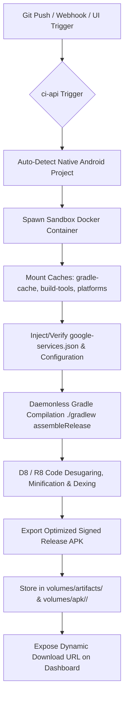

# 🤖 Native Android APK Build Pipeline Guide

This documentation guides you through the architecture, setup, configuration, and optimizations integrated into the DevOps CI/CD pipeline for building Native Android (Java/Kotlin Gradle) APKs on the 16 GB RAM host VPS.

---

## 1. Pipeline Architecture & Flow

The CI server automatically detects Native Android projects (Gradle Kotlin DSL / Groovy with standard `app/` modules) and handles compilation securely inside isolated Docker sandboxes:



---

## 2. CI Server Integration (`vps-infra/ci-server`)

### A. Detection Logic (`build-runner.js`)
The CI server auto-identifies Native Android projects using:
```javascript
const hasNativeAndroid = !hasPubspecYaml && !hasReactNativeAndroid && 
  (fs.existsSync(path.join(codeRepoPath, 'build.gradle')) || 
   fs.existsSync(path.join(codeRepoPath, 'build.gradle.kts')) || 
   fs.existsSync(path.join(codeRepoPath, 'settings.gradle')) || 
   fs.existsSync(path.join(codeRepoPath, 'settings.gradle.kts'))) &&
  (fs.existsSync(path.join(codeRepoPath, 'app')) || 
   fs.existsSync(path.join(codeRepoPath, 'gradlew')));
```

### B. Docker Sandbox Container
Native Android builds are compiled inside the standard `reactnativecommunity/react-native-android:latest` sandbox container (packaged with OpenJDK 17, Android SDK Commandline Tools, and Gradle support).

### C. Host Resource Protections
To prevent heavy Gradle compilation and dexing threads from overloading the 16 GB VPS and freezing other production services, builds are strictly throttled using:
*   CPU limit: `--cpus 2`
*   Memory limit: `-m 6g`
*   Parallel compilation throttle: `CMAKE_BUILD_PARALLEL_LEVEL=1`
*   Gradle workers throttle: `-Dorg.gradle.workers.max=1`
*   JVM Heap throttle: `-Dorg.gradle.jvmargs=-Xmx2560m`

### D. Persistent Caching Strategy
To reduce compilation times from 10+ minutes down to **under 35 seconds**, three persistent cache layers are mounted:
1.  **Gradle Cache**: Mounts `/var/www/vps-infra/ci-server/gradle-cache` to `/root/.gradle` inside the container to preserve resolved dependencies, wrapper distributions, and transformed AARs.
2.  **Build Tools Cache**: Mounts `/var/www/vps-infra/ci-server/android-sdk/build-tools` to `/opt/android/build-tools` to prevent repeated downloads of Android SDK Build-Tools.
3.  **Platforms Cache**: Mounts `/var/www/vps-infra/ci-server/android-sdk/platforms` to `/opt/android/platforms` to preserve installed Android SDK platform headers (e.g. `android-34`, `android-37`).

---

## 3. App Codebase Configuration & Best Practices

Every Native Android application repository (`/var/www/vps-infra/code/<app-name>`) conforms to the following standards:

### A. Gradle properties (`gradle.properties`)
```properties
# Disable Gradle background daemons to keep container lightweight
org.gradle.daemon=false
org.gradle.caching=true

# Throttled heap and single worker for container stability
org.gradle.jvmargs=-Xmx2560m -Dfile.encoding=UTF-8
org.gradle.workers.max=1

# Force Kotlin compiler to run in-process (saves ~2 GB RAM)
kotlin.compiler.execution.strategy=in-process
```

### B. Build Types & Signing (`app/build.gradle.kts` / `app/build.gradle`)
To allow instant release artifact generation without blocking on external CI signing certificates, release builds utilize the debug signing configuration or automated CI keystore:
```kotlin
android {
    buildTypes {
        release {
            isMinifyEnabled = false
            signingConfig = signingConfigs.getByName("debug")
            proguardFiles(
                getDefaultProguardFile("proguard-android-optimize.txt"),
                "proguard-rules.pro"
            )
        }
    }
}
```

### C. Environment-Specific Build Configurations & Flavors (`app/build.gradle.kts`)
To automatically point the mobile app to UAT API (`https://uat-bankmitra-api.tmkcomputers.in/api/`) or Prod API (`https://bankmitra-api.tmkcomputers.in/api/`), the project utilizes Gradle `productFlavors`:
```kotlin
android {
    buildFeatures {
        buildConfig = true
    }

    flavorDimensions += "environment"
    productFlavors {
        create("uat") {
            dimension = "environment"
            buildConfigField("String", "API_BASE_URL", "\"https://uat-bankmitra-api.tmkcomputers.in/api/\"")
            buildConfigField("String", "APP_ENV", "\"uat\"")
        }
        create("prod") {
            dimension = "environment"
            buildConfigField("String", "API_BASE_URL", "\"https://bankmitra-api.tmkcomputers.in/api/\"")
            buildConfigField("String", "APP_ENV", "\"prod\"")
        }
    }
}
```

In the Java application code (`Config.java` / `Api.java`):
```java
import com.bankmitra.BuildConfig;

public class Config {
    public static String API_BASE_URL = BuildConfig.API_BASE_URL;
}

// In Api.java:
String baseUrl = (Config.API_BASE_URL != null && !Config.API_BASE_URL.isEmpty()) 
        ? Config.API_BASE_URL 
        : Config.PROD_BASE_URL;

retrofit = new Retrofit.Builder()
        .baseUrl(baseUrl)
        .addConverterFactory(GsonConverterFactory.create(gson))
        .client(httpClient)
        .build();
```

The CI Server automatically invokes `./gradlew assembleUatRelease` when building for UAT and `./gradlew assembleProdRelease` when building for Production.

### D. Resource Naming Rules
All files inside `app/src/main/res/drawable*` must be lowercase containing only `[a-z0-9_]`. Ensure no uppercase characters exist in filenames (e.g. use `loan_service_banner.jpg` instead of `loan_Service_banner.jpg`).

---

## 4. Verification & Artifact Distribution

### A. Output Locations
When a build completes successfully, the APK is exported to:
1.  **Build Unique Artifact Directory**:
    `/var/www/vps-infra/volumes/artifacts/builds/<buildId>/<app-name>-<env>-release.apk`
2.  **Application Global APK Directory**:
    `/var/www/vps-infra/volumes/apk/<app-name>/<app-name>-<env>-release.apk`
3.  **Environment-Specific Directory**:
    `/var/www/vps-infra/volumes/apk/<app-name>/<env>/<app-name>-<env>-release.apk`

### B. Public Download URLs
The CI server serves APK artifacts dynamically over HTTPS:
*   `https://ci-api.tmkcomputers.in/artifacts/builds/<buildId>/<app-name>-<env>-release.apk`
*   Directly downloadable through the CI Server Web Dashboard and DevOps Manager interface.

### C. Triggering a Manual Build Run (Authenticated API)
```bash
curl -X POST https://ci-api.tmkcomputers.in/api/ci/build \
  -H "Authorization: Bearer <YOUR_JWT_TOKEN>" \
  -H "Content-Type: application/json" \
  -d '{
    "serviceId": "a9e48efe-e3fc-4521-84fb-30fd06d7dc3e",
    "branch": "main",
    "triggeredBy": "developer_manual"
  }'
```
