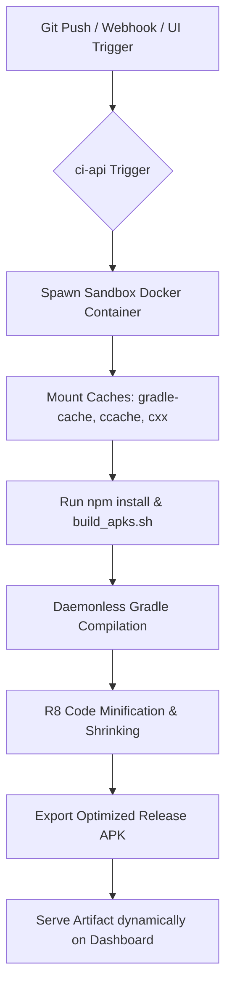

# ⚛️ React Native Android APK Build Pipeline Guide

This documentation guides you through the setup, configuration, and optimizations integrated into the DevOps CI/CD pipeline for building React Native Android APKs on the 16 GB RAM host VPS.

---

## 1. Pipeline Architecture & Flow

The CI server automatically detects React Native projects and handles compilation securely inside isolated sandboxes to protect host resources:



---

## 2. CI Server Integration (`vps-infra/ci-server`)

### A. Docker Sandbox Container
React Native builds are isolated inside the standard `reactnativecommunity/react-native-android:latest` container (packaged with OpenJDK 17). 

### B. Host Resource Protections
To prevent heavy Gradle compilation threads from overloading the 16 GB VPS and freezing other services, builds are throttled in [`build-runner.js`](file:///var/www/vps-infra/ci-server/api/build-runner.js) using:
*   CPU limit: `--cpus 2`
*   Memory limit: `-m 6g`
*   Parallel compilation throttle: `CMAKE_BUILD_PARALLEL_LEVEL=1`
*   Gradle workers throttle: `-Dorg.gradle.workers.max=1`

### C. Caching Strategy (Build Speedups)
To reduce build times from 15+ minutes down to **under 5 minutes**, three persistent cache layers are mounted:
1.  **Gradle Cache**: Mounts `/var/www/vps-infra/ci-server/gradle-cache` as `/root/.gradle` inside the container. This preserves downloaded Maven/Gradle packages.
2.  **C++ Compiler Cache (ccache)**: Mounts `/var/www/vps-infra/ci-server/ccache` as `/root/.ccache` to retain compiled native modules (like Reanimated and Worklets).
3.  **CMake Cache**: Preserves the native `android/app/.cxx` cache folder within the repository code mount.

---

## 3. App Codebase Configuration

Every React Native application repository contains two main optimization components:

### A. The Build Script (`build_apks.sh`)
This script acts as the entrypoint for the compilation container:
*   Resolves local Node dependencies using `npm install --legacy-peer-deps`.
*   Applies environment variables dynamically via `DOTENV_CONFIG_PATH`.
*   Triggers Gradle build in a **daemonless** state (`--no-daemon`) with a strict **3 GB heap allocation** (`-Xmx3072m`) to prevent memory leaks.
*   Preserves the CMake cache by avoiding deletion of the `.cxx` folder.

### B. Gradle Optimizations (`gradle.properties`)
Located inside `android/gradle.properties` in each repository:
```properties
# Disable Gradle background daemons to keep container lightweight
org.gradle.daemon=false
org.gradle.caching=true

# Force Kotlin compiler to run in-process (saves ~2 GB RAM)
kotlin.compiler.execution.strategy=in-process

# Enable R8 minification and resource shrinking to reduce APK sizes
android.enableMinifyInReleaseBuilds=true
android.enableShrinkResourcesInReleaseBuilds=true
```

---

## 4. Verification & Troubleshooting

### A. Triggering a Manual Build Run (Authenticated API)
You can initiate a build programmatically by sending a POST request with your JWT Bearer token:

```bash
curl -X POST https://ci-api.yourdomain.com/api/ci/build \
  -H "Authorization: Bearer <YOUR_JWT_TOKEN>" \
  -H "Content-Type: application/json" \
  -d '{
    "serviceId": "YOUR_PROJECT_SERVICE_ID",
    "branch": "main",
    "triggeredBy": "developer_manual"
  }'
```

### B. Out of Memory (OOM) Recovery
If the compilation daemon crashes with a `Gradle build daemon disappeared unexpectedly` error, check the host memory limits using:
```bash
dmesg -T | grep -i "oom-killer"
```
Ensure that no other concurrent mobile builds are running and that `kotlin.compiler.execution.strategy=in-process` is active to keep memory consumption under the 6G container threshold.
