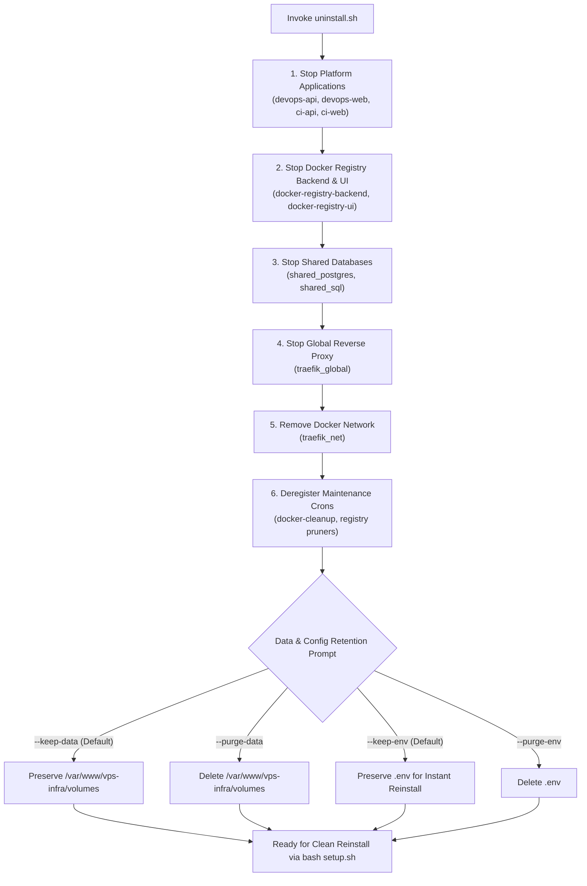

# Client Operations: Clean Uninstall, Private Network Access, and Upgrade Telemetry Guide

## Executive Overview
This guide provides complete technical documentation for three core operational capabilities in the **`vps-infra-client`** runtime:
1. **Clean Uninstall & Reinstallation Support (`uninstall.sh`)**: Safe, dependency-ordered teardown of platform stacks with optional zero-data-loss volume retention.
2. **Private Network Access**: Native support for internal VPCs, LANs, and non-public VPS environments without public Let's Encrypt or external DNS dependencies.
3. **Client Upgrade, Dashboard Notifications & Automated Failure Reporting**: In-dashboard release alerts, one-click detached background upgrades, and automatic telemetry reporting to the Central Licensing Authority upon failure.

---

## 1. Clean Uninstall & Reinstallation System (`uninstall.sh`)

### 1.1 Architecture & Shutdown Sequence
The uninstallation script (`/var/www/vps-infra/uninstall.sh`) cleanly shuts down services in reverse-dependency order to ensure no data corruption occurs in running databases or message queues:



### 1.2 CLI Usage & Parameter Reference
`uninstall.sh` can be executed interactively or non-interactively via flags:

```bash
# Interactive uninstallation (prompts before deleting data or .env)
bash uninstall.sh

# Unattended teardown preserving persistent databases and configurations (Recommended for reinstalls)
bash uninstall.sh --keep-data --keep-env --force

# Complete hard purge (removes all containers, volumes, database files, and .env)
bash uninstall.sh --purge-data --purge-env --force
```

#### Supported CLI Flags:
| Flag | Description | Default |
| :--- | :--- | :--- |
| `--keep-data` | Preserves `/var/www/vps-infra/volumes` (PostgreSQL, MS SQL, registry artifacts, uploads). | **Active by default** |
| `--purge-data` | Permanently deletes `/var/www/vps-infra/volumes`. Requires confirmation in interactive mode. | Inactive |
| `--keep-env` | Preserves `.env` containing your domain names, database passwords, and license keys. | **Active by default** |
| `--purge-env` | Deletes `.env`. | Inactive |
| `-f`, `--force` | Bypasses interactive confirmation prompts. Ideal for CI/CD and automated test suites. | Inactive |
| `-h`, `--help` | Displays usage instructions and available options. | - |

### 1.3 Reinstallation Workflow
Because `--keep-data` and `--keep-env` are the default behaviors, reinstalling a client node requires only two commands:

```bash
# Step 1: Cleanly tear down existing containers
bash uninstall.sh --force

# Step 2: Rerun setup to pull latest images and start clean containers
bash setup.sh
```
All database schemas, table records, user accounts, and container configurations remain completely intact.

---

## 2. Private Network Access (LAN / Internal Subnets / Non-Public VPS)

### 2.1 The Problem in Public-Only Cloud Architecture
Standard cloud deployments rely on public Domain Name Service (DNS) records and public Certificate Authorities (e.g., Let's Encrypt ACME challenges). When a node is placed behind an internal corporate network, private VPC, or air-gapped environment:
1. **Public ACME Challenge Fails**: Let's Encrypt cannot query private RFC 1918 IP addresses (`10.0.0.0/8`, `172.16.0.0/12`, `192.168.0.0/16`) or internal `.local` / `.lan` domains, causing Traefik certificate generation to stall or fail.
2. **Forced HTTPS Redirect Creates Browser Errors**: Traefik redirects all port 80 traffic to port 443; without a valid certificate, users encounter security warnings.
3. **Host Header Routing Rejects Raw IP Addresses**: Routers configured with `Host(devops.example.com)` return `404 page not found` when accessed via direct IP (`http://192.168.1.100`).

### 2.2 Private Network Configuration
To run `vps-infra-client` on an internal machine, configure the following variables in `.env`:

```ini
# ==============================================================================
# NETWORK & ACCESSIBILITY MODE
# ==============================================================================
# Options: 'public' (default, uses Traefik ACME Let's Encrypt) or 'private'
NETWORK_MODE=private

# The static internal IP or LAN hostname of this host
PRIVATE_IP=192.168.1.100

# Set to 'false' to allow clean HTTP access on internal networks
ENABLE_HTTPS_REDIRECT=false
```

### 2.3 Automatic Network Mode Detection in `setup.sh`
`setup.sh` automatically evaluates the network environment:
* If `PRIMARY_DOMAIN` is an IP address matching RFC 1918 ranges, or ends with `.lan` / `.local` / `.internal`:
  * `setup.sh` automatically sets `NETWORK_MODE=private`.
  * Traefik ACME challenge is disabled.
  * Router rules in Traefik are configured with dual matching:
    ```yaml
    traefik.http.routers.devops-web-prod.rule: "Host(`${DEVOPS_WEB_HOST}`) || Host(`${PRIVATE_IP}`) || HostRegexp(`^[0-9.]+$`)"
    ```
  * Users on the internal network can navigate directly to `http://192.168.1.100` and immediately access the DevOps Manager dashboard.

---

## 3. Client Upgrade, Notification & Failure Telemetry

### 3.1 Architecture Overview
The upgrade system allows clients to upgrade their software directly from the Web dashboard, while guaranteeing safety through detached background execution and automatic failure reporting:

```mermaid
sequenceDiagram
    autonumber
    actor ClientAdmin as Client Administrator
    participant WebUI as DevOps Manager Web
    participant Api as DevOps Manager API
    participant Runner as upgrade-client.sh
    participant Master as TMK Central Licensing Authority

    Master->>Api: Routine Heartbeat (returns latestVersion: "v2.4", hasUpdate: true)
    Api->>WebUI: GET /api/system/client-update
    WebUI->>ClientAdmin: Display "🚀 New Update Available: v2.4" Banner
    ClientAdmin->>WebUI: Click [Upgrade Now]
    WebUI->>Api: POST /api/system/client-upgrade
    Api->>Runner: Detached Process Execution (scripts/upgrade-client.sh)
    Api-->>WebUI: 202 Accepted (status: "IN_PROGRESS")
    WebUI->>ClientAdmin: Display Loading Spinner

    rect rgb(20, 30, 50)
        Note over Runner: Detached Host Runner Execution
        Runner->>Runner: 1. Set upgrade.status = IN_PROGRESS
        Runner->>Runner: 2. git fetch & git pull origin main
        Runner->>Runner: 3. bash setup.sh
    end

    alt Upgrade Successful
        Runner->>Runner: Write status = SUCCESS in upgrade.status
        WebUI->>ClientAdmin: "Upgrade completed successfully! Reloading..."
    else Upgrade Failed (Exit != 0)
        Runner->>Runner: Write status = FAILED in upgrade.status
        Runner->>Runner: Capture last 100 lines of upgrade.log
        Runner->>Master: POST /api/v1/telemetry/upgrade-failure
        Note over Master: Persist to upgrade_failure_reports table
        WebUI->>ClientAdmin: "⚠️ Something went wrong while upgrading. Please try again later."
    end
```



### 3.2 The Detached Background Runner (`scripts/upgrade-client.sh`)
When `setup.sh` or `docker compose up -d` executes during an upgrade, the `devops-api-prod` container is recreated. If the upgrade command were executed synchronously inside the API process, the container shutdown would kill the script mid-execution.

To prevent this:
1. `POST /api/system/client-upgrade` launches `scripts/upgrade-client.sh` as a detached, disowned background process on the host.
2. All execution output is piped to `/var/www/vps-infra/upgrade.log`.
3. High-level status is continuously serialized to `/var/www/vps-infra/upgrade.status`:
   ```json
   {
     "status": "IN_PROGRESS",
     "currentVersion": "v2.3",
     "targetVersion": "v2.4",
     "startedAtUtc": "2026-09-10T14:30:00Z",
     "lastStep": "pulling docker images"
   }
   ```

### 3.3 Automatic Failure Telemetry
If any step in `upgrade-client.sh` fails:
1. The script updates `/var/www/vps-infra/upgrade.status`:
   ```json
   {
     "status": "FAILED",
     "errorMessage": "Docker Compose exited with code 1 during container recreation",
     "failedAtUtc": "2026-09-10T14:32:15Z"
   }
   ```
2. The script extracts the tail of `/var/www/vps-infra/upgrade.log` and automatically sends a telemetry payload to the Central Licensing Server:
   * **Endpoint**: `POST https://license.tmkcomputers.in/api/v1/telemetry/upgrade-failure`
   * **Payload**:
     ```json
     {
       "clientId": "c1a938e2-4b21-4cf1-8311-5d9c2e40f812",
       "clientName": "Acme Global Solutions",
       "licenseKey": "TMK-ENT-...",
       "currentVersion": "v2.3",
       "targetVersion": "v2.4",
       "failedStep": "setup.sh: docker compose up",
       "errorMessage": "failed to register layer: disk quota exceeded",
       "logs": "...[last 100 lines of upgrade.log]...",
       "osInfo": "Linux 6.8.0-40-generic x86_64 Ubuntu 24.04 LTS",
       "timestampUtc": "2026-09-10T14:32:15Z"
     }
     ```
3. **Client UI State**:
   * The client Web UI polls `/api/system/client-update` and receives the `FAILED` status.
   * The UI displays a clean, non-intrusive alert:
     > **⚠️ Something went wrong while upgrading. Please try again later.**  
     > *(Detailed diagnostics have been automatically reported to TMK support.)*

### 3.4 Support Triage Workflow in Central Licensing Authority
Support engineers can view and diagnose all upgrade issues directly in the Central Licensing Portal (`https://license.tmkcomputers.in`):
1. Navigate to the **Upgrade Failure Reports** tab in the Licensing Authority UI.
2. View real-time reports sorted by timestamp, showing client organization, IP address, operating system, and target version.
3. Click **Inspect Logs** to open the full diagnostic modal showing the exact command that failed, without requiring the client to manually retrieve log files.

---

## 4. Verification and Test Suite Specifications

### 4.1 Backend Unit Tests
* **Test Suite**: `DevopsPanel.Tests/ClientUpgradeServiceTests.cs` (xUnit)
  * `CompareVersions_SemanticComparison_DetectsNewRelease`: Validates that `v2.4` is recognized as newer than `v2.3`.
  * `StatusFile_SerializationAndDeserialization_PreservesState`: Tests reading and writing of `upgrade.status`.
  * `SanitizeCommandParameters_PreventsShellInjection`: Ensures branch names and flags are properly sanitized.
* **Test Suite**: `license-server/test/telemetry.test.js` (Node Test Runner)
  * `Telemetry_IngestReport_PersistsToSqlite`: Validates `POST /api/v1/telemetry/upgrade-failure` saves records.
  * `Telemetry_AdminQuery_ReturnsFormattedRecords`: Validates `GET /api/v1/license/upgrade-failures` with admin authentication.

### 4.2 Backend Integration Tests
* **Test Suite**: `DevopsPanel.Tests/SystemControllerUpgradeIntegrationTests.cs`
  * Validates `GET /api/system/client-update` returns current upgrade status.
  * Validates `POST /api/system/client-upgrade` returns `202 Accepted` and dispatches the background task.
  * Validates unauthorized access is rejected with `401 Unauthorized`.

### 4.3 Frontend Component & E2E Tests
* **Test Suite**: `devops-manager/web/src/__tests__/ClientUpdateBanner.test.tsx`
  * Tests that `<ClientUpdateBanner />` renders when `updateAvailable: true`.
  * Tests that clicking **Upgrade Now** transitions the button to the disabled loading spinner.
  * Tests that `status: "FAILED"` renders the user-friendly error message.
* **Live Browser E2E Test**:
  * Simulated user workflow using the Antigravity browser agent to verify DOM responsiveness, loading spinner animation, and error message styling.

### 4.4 Infrastructure Shell Integration Tests
* **Test Suite**: `scripts/test-uninstall-and-upgrade.sh`
  * Runs dry-run uninstall tests to ensure `--keep-data` preserves `/var/www/vps-infra/volumes`.
  * Simulates an upgrade failure to ensure telemetry is successfully dispatched to the central server.
