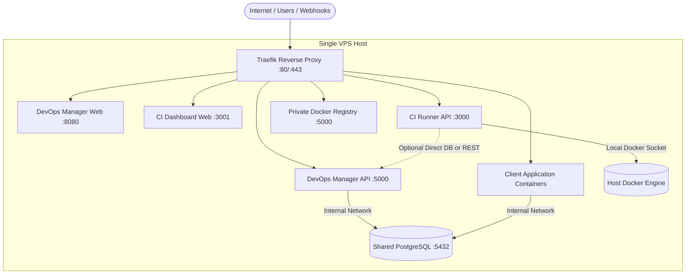
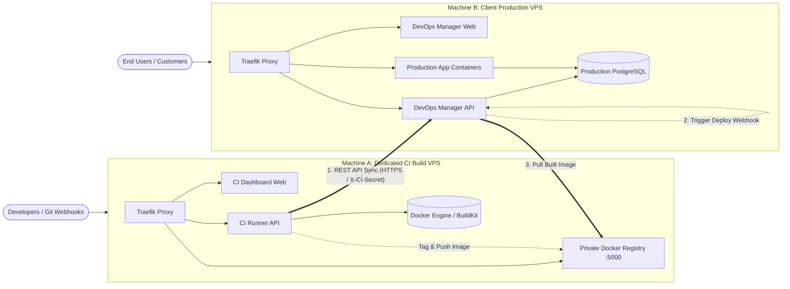
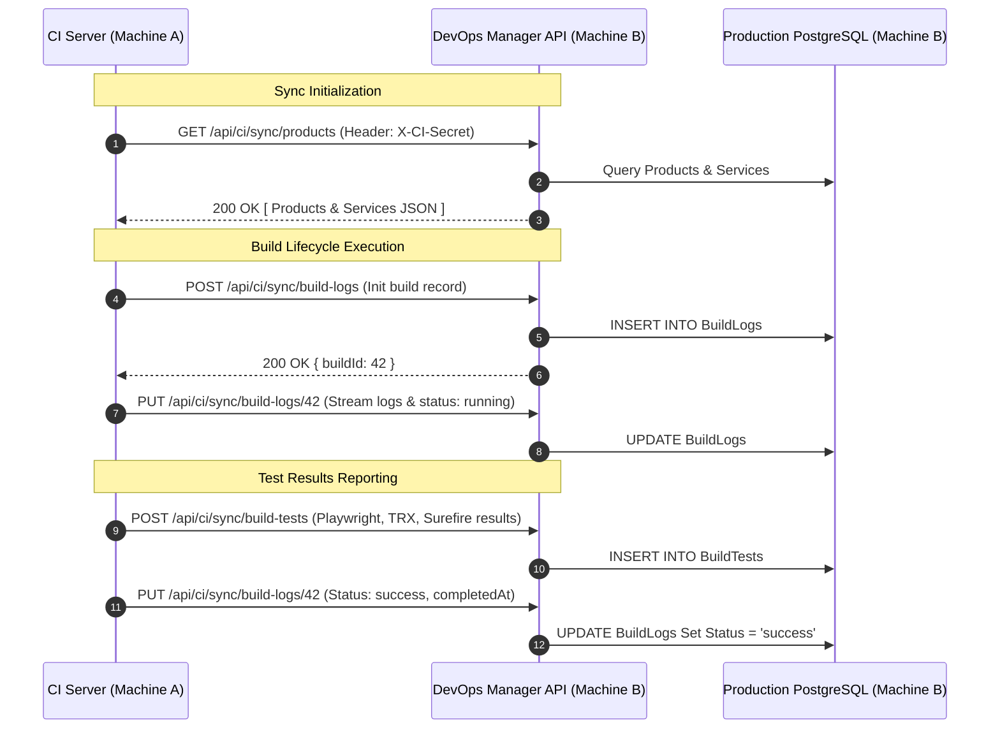

# Dual-Topology Deployment & REST API CI Synchronization Guide

This guide documents the architecture, configuration, and operation of the **Dual-Topology Deployment Model** for the TMK VPS Infrastructure Platform.

---

## 1. Overview & Vision

In production enterprise deployments, continuous integration (CI) workloads—such as building container images, compiling .NET/Java/Node apps, executing resource-intensive Playwright browser test suites, and handling Docker layers—can consume significant CPU, RAM, and I/O. If co-located with production client applications, heavy builds can starve production services of critical resources.

To provide maximum flexibility, the platform natively supports two deployment topologies:

| Feature | Option 1: All-in-One (Single VPS) | Option 2: Distributed (Multi-VPS) |
| :--- | :--- | :--- |
| **Best For** | Small-to-medium teams, staging, cost-effective single server setups | High-traffic production, large build matrices, enterprise SLA isolation |
| **Host Setup** | 1 VPS runs all platform components | Machine A (Dedicated CI Server) + Machine B (DevOps Manager / Client Host) |
| **Resource Isolation**| Shared cgroups / Docker engine | 100% physically isolated CPU, RAM, and disk I/O |
| **Database Access** | Local PostgreSQL (`postgres_net`) | CI Server does NOT connect to PostgreSQL; uses REST API Sync |
| **Registry Options** | Self-hosted private registry or external (GHCR, Docker Hub) | Shared private registry on Machine A/B or external registry |

---

## 2. Architecture Diagrams

### Option 1: All-in-One Topology (Single VPS)



---

### Option 2: Distributed Topology (Dedicated CI + Production VPS)



---

## 3. Database Sync Mechanism: REST API vs Cross-Machine DB

### Why REST API Sync?
Connecting the CI server directly to the remote production PostgreSQL instance over port `5432` introduces security risks:
1. Opening PostgreSQL port 5432 to the public internet exposes the primary database to brute-force attacks and port scans.
2. Managing IP whitelists across cloud VPS providers adds maintenance overhead whenever build runners scale or IPs change.

### REST API Sync Protocol
Instead of cross-machine PostgreSQL connections, the CI Server communicates with the DevOps Manager API exclusively over HTTPS (Port 443) using the `X-CI-Secret` header:



### Endpoints Implemented in DevOps Manager:
- `GET /api/ci/sync/products`: Retrieves registered products and microservices.
- `GET /api/ci/sync/projects`: Retrieves filtered project records.
- `GET /api/ci/sync/services/{id}`: Retrieves detailed service configuration.
- `POST /api/ci/sync/build-logs`: Registers a new build event.
- `PUT /api/ci/sync/build-logs/{id}`: Appends logs and updates build status (`running`, `success`, `failed`).
- `POST /api/ci/sync/build-tests`: Submits parsed unit/integration test results.
- `GET /api/ci/sync/build-logs`: Query build logs with pagination.
- `GET /api/ci/sync/build-logs/{id}`: Query single build log details.
- `GET /api/ci/sync/build-logs/{id}/tests`: Query test results for a specific build.

---

## 4. Docker Registry Hosting Options

The platform supports both self-hosted and external Docker registries.

### Option A: Self-Hosted Private Registry
- Runs as an encrypted, authenticated Docker Registry v2 container.
- Accessible via Traefik at `https://${REGISTRY_HOST}` (e.g., `https://registry.yourdomain.com`).
- On an All-in-One deployment, both builds and deployments interact with `localhost:5000` or the public domain.
- In a Distributed deployment, Machine A or a dedicated node hosts the registry; Machine B pulls images over HTTPS using configured registry credentials.

### Option B: External Docker Registry (GHCR, Docker Hub, ECR)
- Build artifacts are pushed directly to GitHub Container Registry (`ghcr.io/org/...`), Docker Hub, or AWS ECR.
- The local private registry container is automatically skipped:
  ```bash
  DOCKER_REGISTRY_TYPE=external
  DOCKER_REGISTRY_HOST=ghcr.io/your-org
  DOCKER_REGISTRY_USER=your-user
  DOCKER_REGISTRY_PASSWORD=ghp_token...
  ```
- DevOps Manager uses `DOCKER_REGISTRY_HOST` when generating Docker Compose manifests and pulling images during deployment.

### Registry Variable Precedence:
1. `DOCKER_REGISTRY_HOST` (explicit registry override, e.g. `ghcr.io/myorg`)
2. `REGISTRY_HOST` (standard domain from `.env.example`, e.g. `registry.yourdomain.com`)
3. Fallback: `localhost:5000`

---

## 5. CORS Security & Multi-Machine Origin Whitelisting

When running in Distributed Topology, the CI Web UI (`ci-web`) on Machine A sends authenticated API requests to the DevOps Manager API (`devops-api`) on Machine B.

### Security Principles:
- **No Wildcard CORS**: The platform **strictly disallows** `Access-Control-Allow-Origin: *`.
- **Domain Subdomain Auto-Whitelisting**: Any origin that is a subdomain of `PRIMARY_DOMAIN` (e.g. `https://ci.yourdomain.com`, `https://devops.yourdomain.com`) is automatically permitted and echoed back with `Access-Control-Allow-Credentials: true`.
- **Custom Separate Domains via `ALLOWED_CORS_ORIGINS`**: If Machine A uses a distinct domain (e.g. `https://ci-runner.anotherdomain.com`), add it to `.env` on Machine B:
  ```ini
  ALLOWED_CORS_ORIGINS=https://ci-runner.anotherdomain.com,https://ci-qa.anotherdomain.com
  ```
- **Localhost Development**: Local origins (`http://localhost:*`, `http://127.0.0.1:*`) are permitted for developer testing.
- **Untrusted Origins**: Any origin not matching the whitelist receives **no** `Access-Control-Allow-Origin` header and is immediately rejected by the browser.

---

## 6. Deployment & Setup Guide

### 5.1 Interactive Setup
Run `setup.sh` on the target machine. If no CLI flags are supplied, an interactive selector appears:

```bash
sudo ./setup.sh
```

```text
======================================================================
   🌐 SELECT DEPLOYMENT TOPOLOGY
======================================================================
1) All-in-One          : DevOps Manager + CI Server + Registry + PostgreSQL on ONE VPS (Default)
2) DevOps Manager Only : Production / App Host (DevOps Panel, DB, Apps, Traefik)
3) CI Server Only      : Dedicated Build Machine (Build Runner, Artifacts, Docker Engine)
Enter choice [1-3, default: 1]:
```

### 5.2 Automated Non-Interactive Deployment

#### Scenario A: Deploy All-in-One VPS
```bash
sudo ./setup.sh \
  --mode all-in-one \
  --registry-type private \
  --registry-host registry.yourdomain.com
```

#### Scenario B: Deploy Distributed - Machine A (Dedicated CI Server)
```bash
sudo ./setup.sh \
  --mode ci-only \
  --registry-type private \
  --registry-host registry.yourdomain.com \
  --sync-mode api \
  --ci-secret "a-very-strong-shared-secret-32-chars-min"
```
*Note: In `.env`, set `DEVOPS_API_URL=https://devops-api.clientdomain.com`.*

#### Scenario C: Deploy Distributed - Machine B (DevOps Manager & Apps)
```bash
sudo ./setup.sh \
  --mode devops-only \
  --registry-type external \
  --registry-host registry.yourdomain.com \
  --registry-user deployuser \
  --registry-pass "secure-registry-token" \
  --ci-secret "a-very-strong-shared-secret-32-chars-min"
```

---

## 7. Docker Compose Profiles Reference

Docker Compose profiles ensure only the relevant containers run on each host:

| Service | Profiles | Description |
| :--- | :--- | :--- |
| `devops-manager-api` | `["all", "devops"]` | Core backend REST API & Deploy engine |
| `devops-manager-web` | `["all", "devops"]` | Angular frontend administrative portal |
| `ci-server-api` | `["all", "ci"]` | Node.js CI build runner & artifact distributor |
| `ci-server-web` | `["all", "ci"]` | React/Vite CI dashboard interface |

Manual execution using Docker Compose:
```bash
# Run all services
docker compose --profile all up -d

# Run DevOps Manager only
docker compose --profile devops up -d

# Run CI Server only
docker compose --profile ci up -d
```

---

## 8. Verification & E2E Testing

To test and verify profile isolation and synchronization integrity on any node:

```bash
# Run the automated verification suite
./scripts/test-dual-topology-sync-e2e.sh
```

Checks performed:
- [x] Compose profile isolation (`all`, `devops`, `ci`)
- [x] CI Server Data Provider unit tests (`SYNC_MODE=api` vs `SYNC_MODE=db`)
- [x] DevOps Manager `CiSyncController` integration tests (`X-CI-Secret` auth, 401 on unauthorized)
- [x] Strict CORS Origin validation (no wildcard `*`, subdomains allowed, untrusted blocked)
- [x] Registry resolution precedence validation
