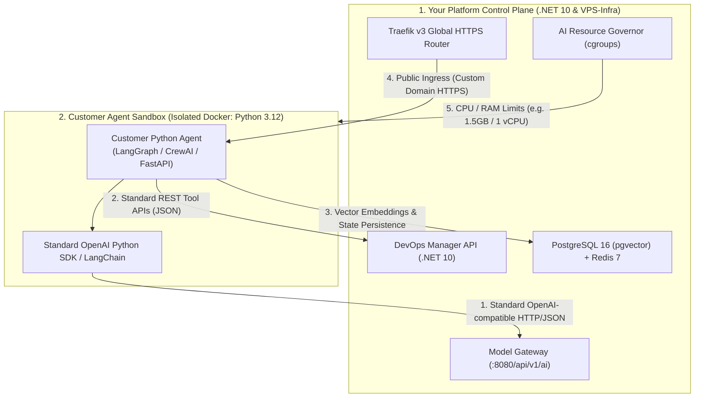
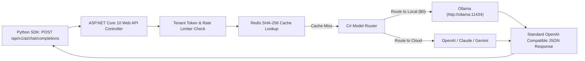

# 🐍 Polyglot Customer Agents: Building Python Agents on a .NET 10 Platform

> **Document Version**: 1.0.0  
> **Status**: Approved Architectural Integration Specification  
> **Target Audience**: AI Developers, Startups, Systems Architects  
> **Core Concept**: Explains how clients build custom AI agents in **Python** (using LangGraph, CrewAI, FastAPI, or LlamaIndex) while running on top of our **.NET 10** Control Plane and VPS infrastructure.

---

## 1. The Core Architecture: Host Control Plane vs. Customer Workloads

Just as **Docker** and **Kubernetes** are written in **Go** but run applications in any programming language, our **.NET 10** platform (`devops-manager/api`) acts as the **Host Control Plane & Infrastructure Orchestrator**, while customer agents run as isolated **containerized Python applications**.



---

## 2. How Clients Write Their Python Agent (Zero .NET Knowledge Required)

The client writes standard, idiomatic Python. They interact with our platform's Model Gateway using the official, standard `openai` or `langchain` Python packages:

### Example: Standard Python LangGraph / OpenAI Agent

```python
import os
from openai import OpenAI

# 1. The client points to the .NET 10 Model Gateway on the internal Docker network
client = OpenAI(
    base_url="http://devops-api:8080/api/v1/ai", 
    api_key="client_tenant_api_key"
)

# 2. Calling models (The .NET Gateway transparently routes to Local Ollama or Cloud APIs)
response = client.chat.completions.create(
    model="llama3.2:3b",  # or "gpt-4o", "claude-3-5-sonnet", "deepseek-r1"
    messages=[
        {"role": "system", "content": "You are an autonomous customer support agent."},
        {"role": "user", "content": "Analyze and summarize this customer ticket."}
    ],
    temperature=0.2
)

print("Agent Response:", response.choices[0].message.content)
```

---

## 3. How the .NET 10 Gateway Handles Python Requests

When the customer's Python agent makes a request:



**Key Advantages**:
* **Language-Agnostic Wire Protocol**: Everything happens over standard HTTP/2 and JSON.
* **SDK Compatibility**: Startups can use any library (`openai`, `langchain`, `crewai`, `autogen`, `llamaindex`) without vendor lock-in.

---

## 4. How Customer Python Agents Are Deployed & Isolated

When a startup pushes their Python agent to Git:

1. **Build Step (`ci-server`)**:
   - Compiles the Python Docker image (`FROM python:3.12-slim`).
   - Installs their custom dependencies (`pip install langgraph pydantic fastapi`).
2. **Execution & Resource Capping (`devops-manager`)**:
   - Spawns the container on `traefik_net`.
   - Injects tenant database credentials (`DATABASE_URL=postgresql://...`).
   - Enforces strict Docker cgroup resource constraints:
     ```yaml
     mem_limit: 1500m
     cpus: 1.0
     restart: always
     ```
3. **Automated HTTPS Ingress**:
   - Traefik automatically provisions a Let's Encrypt SSL certificate for `https://agent.customer-startup.com`.

---

## 5. Division of Responsibility: Customer Python Agent vs. .NET 10 Platform

| Customer's Python Agent (Business Logic Only) | Your .NET 10 VPS Platform (Infrastructure & Governance) |
| :--- | :--- |
| 1. Writing LangGraph state graphs and agent prompts | **Host Container Lifecycle** & cgroup resource limits |
| 2. Building custom business tools (Stripe, Email, APIs) | **Universal AI Model Gateway** (Local Ollama + Cloud APIs) |
| 3. Designing their frontend / mobile interface | **Traefik Automated HTTPS** routing & custom domains |
| 4. Choosing which model to query (Llama / GPT / Claude) | **Multi-Tenant Token Rate Limiting** & spend tracking |
| 5. Setting up their business database tables | **PostgreSQL 16 `pgvector`** indexing & automated backups |

---

## 6. Summary

* **No C# or .NET knowledge is required by the customer**.
* The platform exposes **universal, open-standard HTTP/JSON and OpenAI-compatible REST APIs**.
* Startups get the best of both worlds: the **rich AI ecosystem of Python** paired with the **high-performance, battle-tested infrastructure control plane of .NET 10**.
